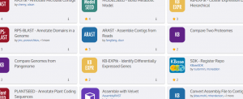
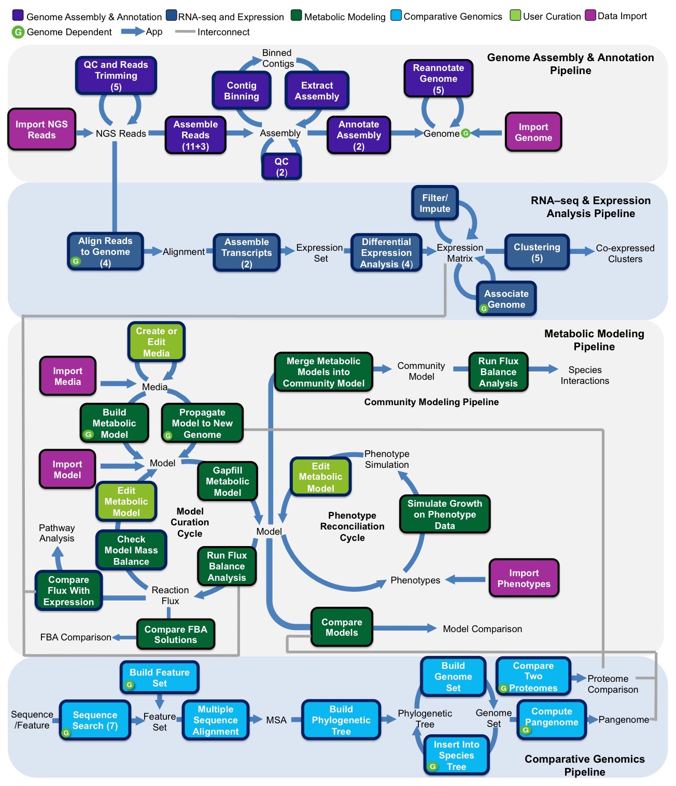
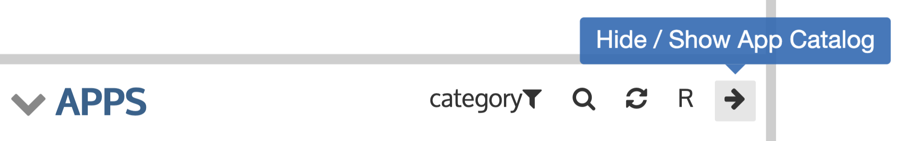
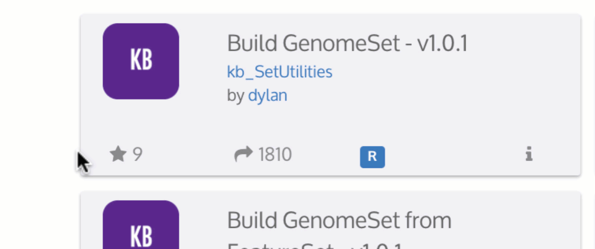
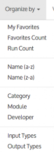

# Analysis Apps in KBase

**KBase Apps** are analysis tools that you can use in KBase. Apps interoperate seamlessly to enable a range of scientific workflows \(see figure below\). Some of the apps were written by KBase scientists and developers; others are third-party tools that were integrated into KBase with our [Software Developer Kit \(SDK\)](../../development/kbase-sdk.md). The number of apps available in KBase increases as members of the community use our SDK to integrate their analysis tools into the KBase platform.

### The App Catalog lists currently available Apps. 

* External [App Catalog](https://kbase.us/applist/) \(no user account or sign-in required for browsing\).
* Within KBase by clicking on the Catalog icon in the Menu  
* In a Narrative by clicking the right arrow at the top of the Apps Panel.

The majority of KBase Apps fall into the following categories:

* [Assembly](assembly-and-annotation.md#assembly)
* [Annotation](assembly-and-annotation.md#annotation)
* [Sequence alignment and search](https://kbase.us/applist/#Sequence%20Analysis)
* [Metabolic modeling](metabolic-modeling.md)
* [RNA-seq and expression data analysis](expression.md)
* [Comparative and phylogenetic analysis](comparative-genomics.md)


**Show me!**  
Go straight to the [App Catalog](https://narrative.kbase.us/#appcatalog)  

Note: you will need a [KBase user account](../../getting-started/sign-up/#signing-up) to use our tools.


Below is an example outline of the major workflows and datatypes in KBase. The unboxed labels represent datatypes, while each colored box represents a single KBase App. The box colors signify the category of functionality, and the numbers in parentheses indicate the number of alternative apps that implement each function. Apps that require a genome as input are marked with a green “G” icon.

### Tips on using the [App Catalog](https://kbase.us/applist)

* Each app links to a reference page \(which includes technical details about the inputs and outputs\) called an App Details Page.
* To run apps, you will need to [sign in to the Narrative Interface](../../getting-started/sign-up/#signing-in).
* You can access the App Catalog from inside the Narrative Interface by clicking the small arrow in the upper right corner of the Apps Panel.

* You can click the star at the lower left of any app to add it to your “favorites.” The gray star will turn yellow to indicate that you have favorited the app. The number to the right of the star shows how many people have favorited that app.

By default, the apps are sorted by category. Try the options in the “Organize by” menu to sort the apps by My Favorites, Run Count and other options.

**More info**

For more information about using the App Catalog, see the [Narrative Interface User Guide](../../getting-started/narrative/).

