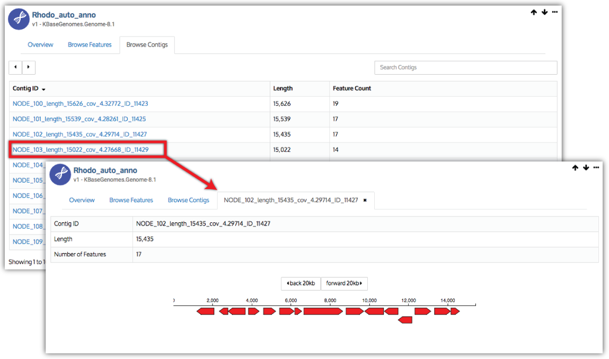

# Assembly and Annotation

KBase provides multiple Apps for _de novo_ [assembly](https://kbase.us/applist/#Genome%20Assembly) of prokaryotic Next-Generation Sequencing (NGS) reads from various sequencing platforms. These assemblies can then be [annotated](https://kbase.us/applist/#Genome%20Annotation) to explore structural and functional features of a Genome or use it in other analyses. The [interactive tutorials](../../workflows/assembly-annotation/) are a good way to learn about these workflows

### **Read Processing**

* [Trim Reads with Trimmomatic](https://kbase.us/applist/apps/kb\_trimmomatic/run\_trimmomatic/release) – Read trimming and adaptor removal
* [Filter Out Low-Complexity Reads with PRINSEQ](https://kbase.us/applist/apps/kb\_PRINSEQ/execReadLibraryPRINSEQ/release) – Filter low complexity reads
* [Assess Read Quality with FastQC](https://kbase.us/applist/apps/kb\_fastqc/runFastQC/release) – Quality assessment and reporting
* [Cutadapt](https://kbase.us/applist/apps/kb\_cutadapt/remove\_adapters/release) – Custom adapter removal

### Assembly

_De novo_ [assembly](https://kbase.us/applist/#Genome%20Assembly) of Illumina and Ion Torrent next-generation sequencing reads. Supports single-end and paired-end read libraries.

* [Assemble with HipMer](https://kbase.us/applist/apps/hipmer/run\_hipmer\_hpc/release) – [HipMer](https://sourceforge.net/p/hipmer/wiki/Home/) is a highly-parallelized port of JGI’s Meraculous assembler. Meraculous is a de Bruijn graph-based which increases speed by not performing error correction. Instead, it bases contigs on already high-quality scores and fills the gaps based on localized assemblies from the reads. HipMer enhances the speed of Meraculous.
* [Assemble with IDBA-UD](https://kbase.us/applist/apps/kb\_IDBA/run\_idba\_ud/release) – [IDBA-UD](http://i.cs.hku.hk/\~alse/hkubrg/projects/idba\_ud/) is an iterative graph-based assembler for single-cell and standard short read data and is good for data of highly uneven sequencing depth. This assembler uses an iterative approach for selecting k-mer size that compensates for the information loss associated with single k-mer based de Bruijn graphs, making IDBA-UD one of the more accurate microbial assemblers.
* [Assemble with MaSuRCA](https://kbase.us/applist/apps/kb\_MaSuRCA/run\_masurca\_assembler/release) – [MaSuRCA](https://academic.oup.com/bioinformatics/article/29/21/2669/195975/The-MaSuRCA-genome-assembler) is a short read assembler that combines the benefits of de Bruijn graph and overlap layout consensus assembly approaches. The main concept is the creation of super-reads that contain sequence information present in the original reads, which super-reads are then extended in both directions using an efficient k-mer lookup table. MaSuRCA is one of a smaller set of assemblers biologists use for eukaryotic assembly.
* [Assemble with MEGAHIT](https://kbase.us/applist/apps/MEGAHIT/run\_megahit/release) – [MEGAHIT](https://academic.oup.com/bioinformatics/article-lookup/doi/10.1093/bioinformatics/btv033) is a single node assembler for large and complex metagenomics NGS reads. It makes use of succinct de Bruijn graph (SdBG) to achieve low memory assembly, making it fast and especially suitable for assembly of small metagenomes, metatranscriptomes or low-coverage data in general.
* [Assemble with SPAdes](https://kbase.us/applist/apps/kb\_SPAdes/run\_SPAdes/release) – [SPAdes](http://online.liebertpub.com/doi/full/10.1089/cmb.2012.0021) is a single-cell and standard assembler based on paired de Bruijn graphs, considered to be one of the most accurate microbial assemblers. SPAdes employs a multisized de Bruijn graph which detects and removes bubble and chimeric reads, estimates insert distance from paired kmers, and computes contigs based on paired assembly graph.
* [Assemble with Velvet](https://kbase.us/applist/apps/Velvet/run\_velvet/release) – [Velvet](http://onlinelibrary.wiley.com/doi/10.1002/0471250953.bi1105s31/full) is a classic de Bruijn graph based assembler that works by efficiently manipulating de Bruijn graphs through simplification and compression. It eliminates errors and resolves repeats by first using an error correction algorithm that merges sequences together. Repeats are then removed from the sequence via the repeat solver that separates paths which share local overlaps.
* [Compare assemblies with QUAST](https://kbase.us/applist/apps/kb\_quast/run\_QUAST\_app/release) – Assess the output assemblies from different configurations of the same assembler, or compare assemblies from multiple assemblers to determine which one is optimal for downstream analysis.

### Annotation

Genomes can be [annotated](https://kbase.us/applist/#Genome%20Annotation) with Prokka or RAST.&#x20;

* [Annotate Domains in a Genome](https://kbase.us/applist/apps/DomainAnnotation/annotate\_domains\_in\_a\_genome/release) – identifies protein domains from widely used domain libraries (COGs, TIGRfams, Pfam).
* [Annotate Assembly with Prokka](https://kbase.us/applist/apps/ProkkaAnnotation/annotate\_contigs/release) – combines multiple open-source annotation tools in a quick and thorough annotation pipeline for prokaryotic sequences for genomes, plasmids, and metagenomes.
* [Annotate Microbial Assembly](https://kbase.us/applist/apps/RAST\_SDK/annotate\_contigset/release) – uses components from the RAST ([Rapid Annotations using Subsystems Technology](http://rast.nmpdr.org)) toolkit to annotate an assembled bacterial or archaeal genome.
* [Annotate Microbial Genome](https://kbase.us/applist/apps/RAST\_SDK/reannotate\_microbial\_genome/release) – uses RAST to annotate a prokaryotic genome, to update the annotations of a genome, or to perform computations on a set of genomes so that they are consistent.
* [Annotate Plant Coding Sequences with Metabolic Functions](https://kbase.us/applist/apps/kb\_plant\_rast/annotate\_plant\_transcripts/release) – performs functional annotation of plant cDNA or protein sequences.

_The output of the annotation apps is a Genome, which is displayed in a tabular genome viewer (see below) that shows information about the Genome as well as a list of contigs and the genes that were called on each contig._

