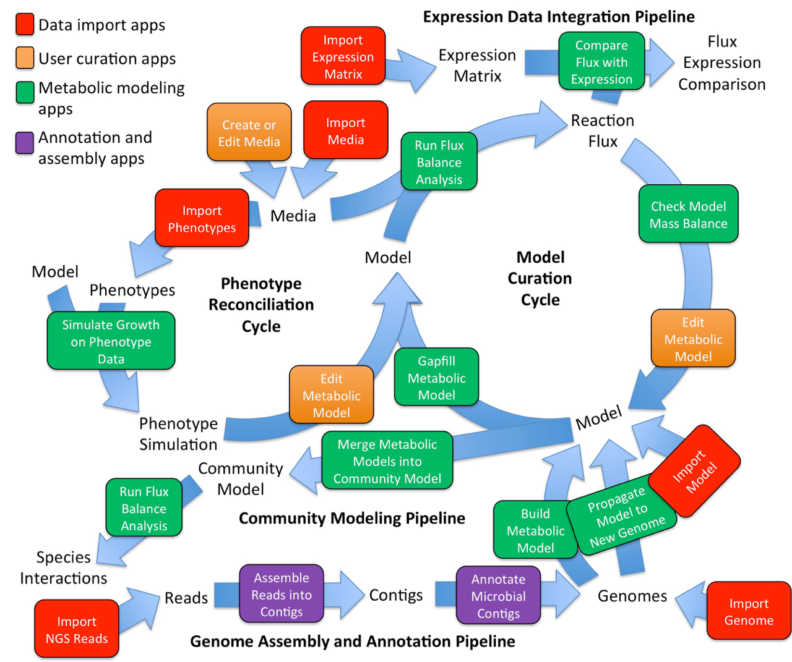

# Metabolic Modeling

KBase has a suite of [Apps](https://kbase.us/applist/#Metabolic%20Modeling) supporting the reconstruction, prediction, and design of metabolic models in microbes and plants. Genome-scale metabolic models can be used to explore an organism’s growth in specific media conditions, determine which biochemical pathways are present, optimize production of an important metabolite, identify high flux pathways, and more.

### **Flux Balance Analysis**

* [Build Metabolic Model](https://kbase.us/applist/apps/fba\_tools/build\_metabolic\_model/release) – Construct genome-scale metabolic models from a genome and media condition&#x20;
* [Gapfill Metabolic Model](https://kbase.us/applist/apps/fba\_tools/gapfill\_metabolic\_model/release) – Fill in missing reactions based on stoichiometry
* [Run Flux Balance Analysis](https://kbase.us/applist/apps/fba\_tools/run\_flux\_balance\_analysis/release) – Predict metabolic fluxes
* [Compare FBA solutions](https://kbase.us/applist/apps/fba\_tools/compare\_fba\_solutions/release) – __ Determine optimal conditions of flux&#x20;
* [Check Model Mass Balance](https://kbase.us/applist/apps/fba\_tools/check\_model\_mass\_balance/release) – Ensure accuracy&#x20;
* [Compare Models](https://kbase.us/applist/apps/fba\_tools/compare\_models/release) – View multiple models side by side

### Editing Models

* [Edit Metabolic Model](https://kbase.us/applist/apps/fba\_tools/edit\_metabolic\_model/release) – Build unique models suited to specific experiments.&#x20;
* __[Create or Edit Media](https://kbase.us/applist/apps/fba\_tools/edit\_media/release) – Create specialized growth conditions
* [Bulk Download Modeling Objects](https://kbase.us/applist/apps/fba\_tools/bulk\_download\_modeling\_objects/release) – Save modeling data for future analysis&#x20;

### Comparative Genomics

* [Propagate Model to New Genome](https://kbase.us/applist/apps/fba\_tools/propagate\_model\_to\_new\_genome/release) – Translate metabolic models from one organism to another

### Expression

* [Compare Flux with Expression ](https://kbase.us/applist/apps/fba\_tools/compare\_flux\_with\_expression/release)– Compare reaction fluxes with gene expression values to identify metabolic pathways where expression and flux data agree or conflict
* [Simulate Growth on Phenotype Data](https://kbase.us/applist/apps/fba\_tools/simulate\_growth\_on\_phenotype\_data/release) – Reconcile models with empirical data

### **Microbial Communities**

* [Merge Metabolic Models into Community Model](https://kbase.us/applist/apps/fba\_tools/merge\_metabolic\_models\_into\_community\_model/release) – Investigate community metabolism&#x20;

Flowchart of apps used in Metabolic Modeling.


**Learn More**

The flowchart above shows KBase’s metabolic modeling tools (green) as well as some other analysis tools. Check the [App Catalog](https://kbase.us/applist/#Metabolic%20Modeling) for the latest set of metabolic modeling analysis tools.

