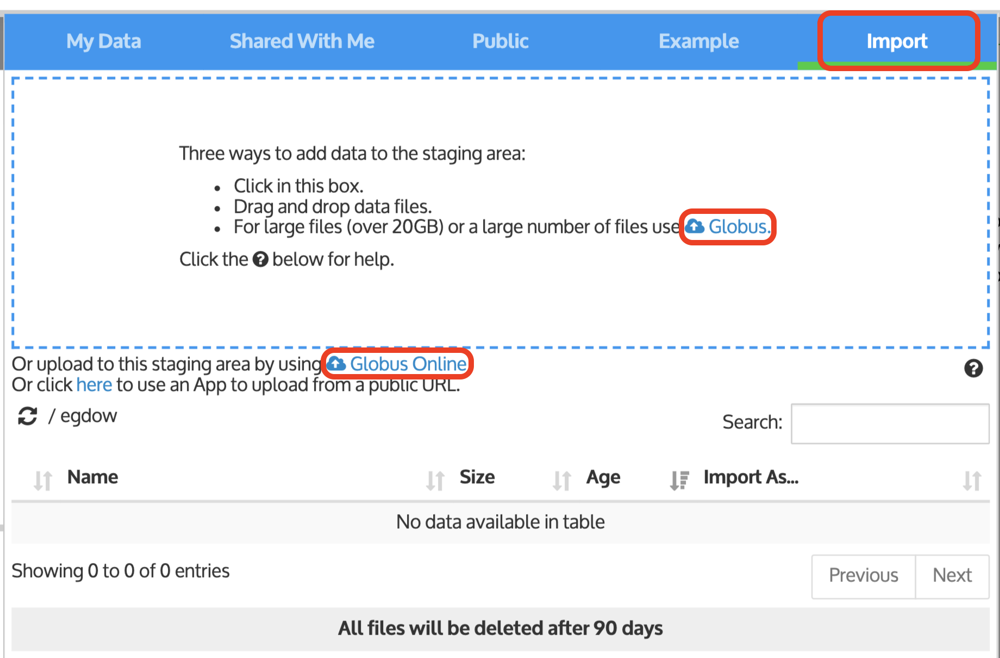
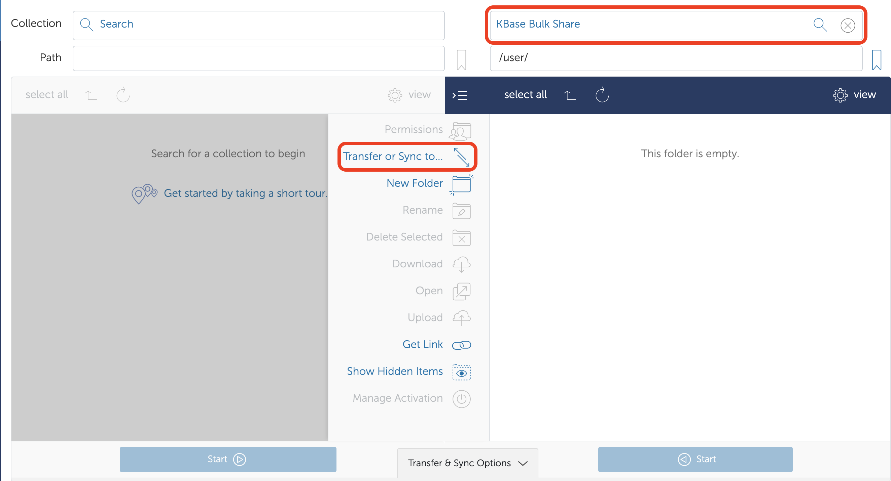
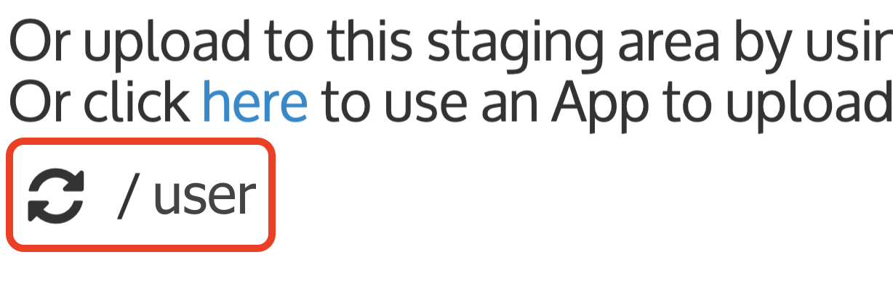

# Transferring Data with Globus

Transfer large files \(~20GB and more\) to KBase using [Globus](https://www.globus.org/). Drag & drop from your local computer works for many files, but there is a size limit dependent on your computer and browser. 

Globus is a data management and file transfer system that can facilitate bulk transfer of data \(large data files or a large number of files\) between two endpoints. The endpoints that apply here are KBase, JGI, and your local computer. The KBase endpoint is called “KBase Bulk Share,” and JGI has their own way to link to Globus. To do any transfer using Globus, you will need a [Globus account](https://www.globusid.org/create). 

Your local computer can become a Globus endpoint with a [Globus Connect Personal Endpoint](https://docs.globus.org/how-to/). This is necessary for transfers to or from your local computer.

Once you have a Globus account, link to your KBase account to facilitate file transfers. See [Linking Accounts](../getting-started/sign-up/linking-accounts.md) for further guidance. 

### Starting a Globus Data Transfer

To initiate a transfer using Globus, click 'Or upload to this staging area by using Globus Online' in the _Import_ tab of the **Data Browser** below the Staging Area**.**

This brings you to a page that looks like this:

The panel on the right should be set to “KBase Bulk Share,” which directs to the Staging Area. In the example image above, the share point is at the root directory, and the _user_ needs to click on their individual directory. If needed, Globus can be used to create new directories in your Staging Area for your data transfer and to delete staging files when you are done importing into KBase.

Set the left panel to the location of the data you want to transfer \(i.e. you could choose the JGI endpoint they send via email\). On the KBase endpoint, if you don’t see a directory with your name as in the example above, add /username to the Path for the KBase endpoint \(/user/ is used in the example above\).

You are then be able to drag data files or folders from the left endpoint to the right one, inside the Globus interface, and the files will appear in your KBase Staging Area.

Your transfer request will be submitted to Globus. If there are network or other problems, Globus will retry several times before giving up. Globus will send an email when the transfer is complete. In the KBase Staging Area, you may need to click on the refresh icon \(two encircling arrows to the left of the user name\) to update the _Import_ tab.

### **Firewalls**

Some government institutions have a firewall between users and the outside world. In an effort to increase security, many web links can be blocked, including Globus traffic. If you see a message that ends with “Details: 500 Command failed….”, a firewall may be the cause.

### **Uploading data from JGI**

If you are a JGI user, you can transfer public genome reads and assemblies \(and your private data and annotated genomes\) from JGI to your KBase account—see [this page](jgi-transfer.md) for instructions.

