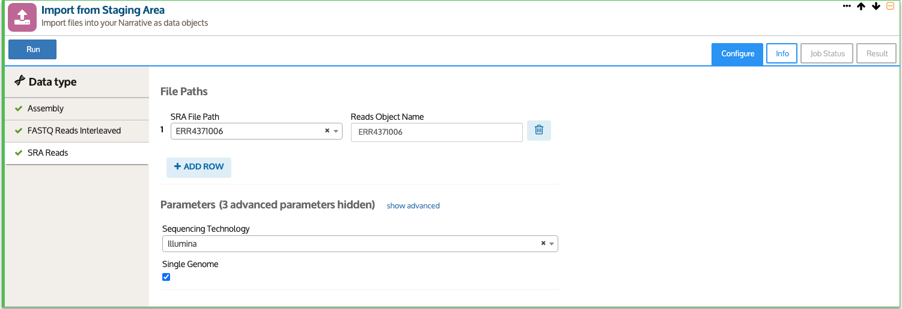

# Bulk Import Guide

Bulk import is finally here! One of the most requested features we’ve received is the ability to import many files into the Narrative at once, and we are happy to announce that is now possible.

## How it works

When you open a new Narrative you’ll notice that the Staging Area has updated. Now data type selection can detect the file type based on extension, when possible. You may notice some types will not automatically select, such as .fasta or .fastq. In cases like this, several KBase data types can use that file subtype. However, the possible data types are listed at the top of the drop down under “Suggested Types.” To run a bulk import, make sure all the files you want to import have their file type selected and the check box active, then click Import Selected. 

You’ll see a new import cell created for bulk imports. This cell contains a tab for each of the file types you selected from the staging area, which you can view by clicking on the appropriate file type in the data type column on the left. This cell is a bulk wrapper for existing import apps, so you can fill out the parameters the same as you would for a single import. Be aware that the bulk import currently only supports a single parameter set per data type. If you need to upload files of a given data type with different parameters, perform a separate import for each parameter set.

Once you kick off your jobs, you will still be able  see all the logs and status details in the Job Status tab, but arranged for the bulk import. You can expand each of the child jobs by clicking on the corresponding line to view details, then expand further to see the logs.

Once the jobs are completed successfully, you’ll be able to see all the information on the data object, repackaged for viewability in bulk. The first new feature is a table of all successful jobs. Clicking on object names adds a viewer widget to the Narrative. All the reports are available under the Reports tree. The full list is collapsed by default to conserve memory. The list can be expanded to show each report, which can still be viewed in a separate window. 

## What data types does this apply to?

While this will be applicable to all file types in the future, bulk import currently supports the following data types:

* Assembly - FASTA
* SRA Reads - FASTQ
* FASTQ Reads Interleaved - FASTQ Interleaved reads
* FASTQ Reads Noninterleaved - FASTQ paired-end reads
* GenBank Genome - GenBank
* GFF Metagenome - FASTA and GFF3

## What are the limitations?

This is a new feature in KBase, and the current release should be considered a beta version with future development still to come. Some of the most notable limitations are listed here. This is not a comprehensive list but does contain the known bugs, issues, and limitations that are the highest priority for future releases. 

### Known Bugs and Limitations:

* Issue: As previously mentioned, only a single set of parameters can be used for a given type in a given bulk import. 
  * Workaround: Subset your imports and run an app cell for each subset with a single set of parameters. Note that this only applies to different parameters within an import type. If you have a set of Illumina reads, PacBio reads, and assemblies, you can import one of the sets of reads and the assemblies in one import, and the other type of reads in a separate import.
* Issue: Staging Area allows uploading incomplete files, leading to data corruption.
  * Workaround: This is an existing issue in the staging area that exists for single-file imports as well. Ensure that your files have fully uploaded and the file size in the staging area matches the size of the file from your machine. 
* Issue: Locating the job status for each import within the Bulk Import cell. 
  * Workaround: Some users have found it not immediately apparent how to view the job status. The status can be viewed within the Job Status tab of the App cell by clicking anywhere on the line for a child job to expand that job.
* Issue: Layout doesn’t appear to adjust to data pane collapse/restore. 
  * Workaround: This is a visual bug that covers up part of the UI. Switching tabs has been found to force a redraw of the table which fixes the issue.
* Issue: Autofill for certain data types does not work. 
  * Workaround: Currently our implementation does not read files in a way to recognize pairs of files that go together, such as pairs of non-interleaved FASTQ files. During import these will need to be manually assigned to a forward or reverse read. 
* Issue: Logs/reports/status do not appear. 
  * Workaround: There have been infrequent bugs found in which logs failed to appear, jobs reported as successful but no report could be generated, and similar issues. Reloading the page has been found to fix all these issues so far.
* Issue: Bulk jobs allow overwriting existing objects. 
  * Workaround: The jobs should be reviewed prior to starting to ensure there are no duplicate names or no names that would overwrite existing objects. If it is discovered that an object has been incorrectly overwritten, the object can be reverted to the previous version.

