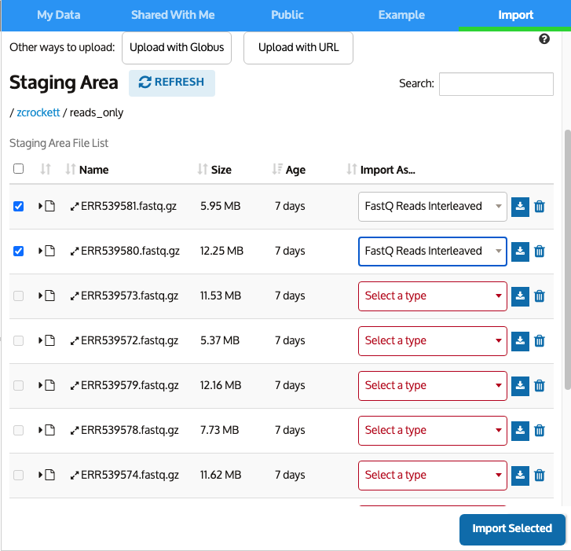
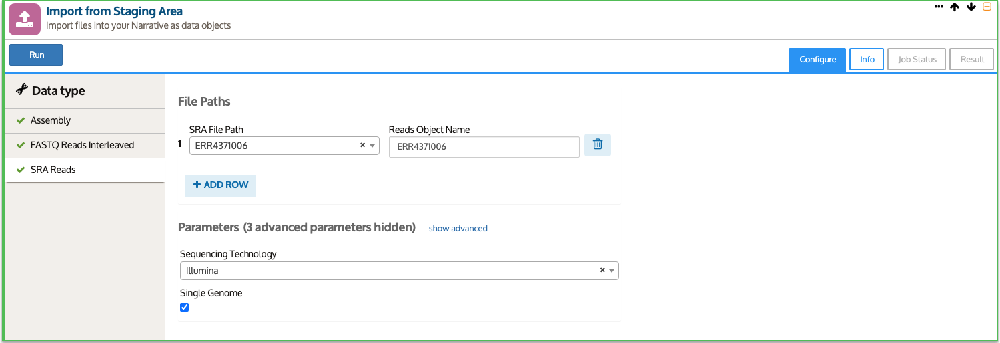

# Bulk Import Guide

Bulk import is finally here! One of the most requested features we’ve received is the ability to import many files into the Narrative at once, and we are happy to announce that is now possible.

## How it works

When you open a new Narrative you’ll notice that the Staging Area has updated. Now data type selection can detect the file type based on extension, when possible. You may notice some types will not automatically select, such as .fasta or .fastq. In cases like this, more than one importer can use that file subtype. However, the possible importers are listed at the top of the drop down under “Suggested Types.” For example, files with the extension FASTQ can be imported as a single interleaved file or as a pair of forward and reverse non-interleaved files to create a PairedEndLibrary, or as a single non-interleaved file to create a SingleEndLibrary. To run a bulk import, make sure all the files you want to import have their file type selected and the check box active, then click Import Selected. 

You’ll see a new import cell created for bulk imports. This cell contains a tab for each of the file types you selected from the staging area, which you can view by clicking on the appropriate file type in the data type column on the left. This cell is a bulk wrapper for existing import apps, so you can fill out the parameters the same as you would for a single import. Be aware that the bulk import currently only supports a single parameter set per data type. If you need to upload files of a given data type with different parameters, perform a separate set of bulk imports for each parameter set. 

Once you kick off your jobs, you will still be able  see all the logs and status details in the Job Status tab, but arranged for the bulk import. You can expand each of the child jobs by clicking on the corresponding line to view details, then expand further to see the logs.

Once the jobs are completed successfully, you’ll be able to see all the information on the data object, repackaged for viewability in bulk. The first new feature is a table of all successful jobs. Clicking on object names adds a viewer widget to the Narrative. All the reports are available under the Reports tree. The full list is collapsed by default to conserve memory. The list can be expanded to show each report, which can still be viewed in a separate window. 

## What data types does this apply to?

While this will be applicable to all file types in the future, bulk import currently supports the following data types:

* Assembly - FASTA
* SRA Reads 
* FASTQ Reads Interleaved - FASTQ Interleaved reads
* FASTQ Reads Noninterleaved - FASTQ paired-end reads or FASTQ single-end reads library
* GenBank Genome - GenBank
* GFF Metagenome - FASTA and GFF3

## What are the limitations?

This is a new feature in KBase, and the current release should be considered a beta version with future development still to come. Some of the most notable limitations are listed here. This is not a comprehensive list but does contain the known bugs, issues, and limitations that are the highest priority for future releases. You can see a list of common bugs and limitations here: link

