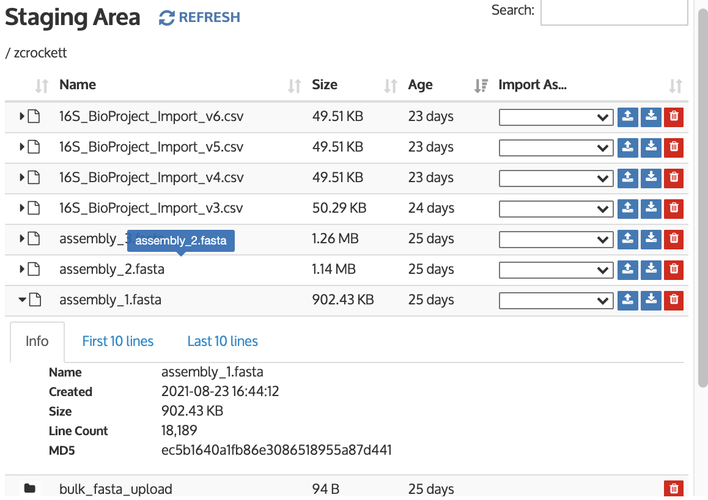

# Bulk Import Limitations

## Known Issues and Limitations

* Issue: Only a single set of parameters can be used for a given type in a given bulk import.&#x20;
  * Workaround: Subset your imports and run an app cell for each subset with a single set of parameters. Note that this only applies to different parameters within an import type. If you have a set of Illumina reads, PacBio reads, and assemblies, you can import one of the sets of reads and the assemblies in one import, and the other type of reads in a separate import.
* Issue: Staging Area allows uploading incomplete files, leading to data corruption.
  * Workaround: This is an existing issue in the staging area that exists for single-file imports as well. Ensure files have fully uploaded and the file size in the staging area matches the size of the file from your machine. You can use MD5 checksums to verify the file uploaded correctly. You can view the MD5 inside the staging area by viewing the info for the file, as shown in the screenshot below. Then, verify that the MD5 in the staging area matches the MD5 on your local machine using the following command depending on your operating system (replacing "assembly\_1.fasta" with your file name):
    * MacOS: `md5 assembly_1.fasta` &#x20;
    * Windows: `certutil -hashfile assembly_1.fasta md5`
    * Linux: `md5sum assembly_1.fasta`&#x20;

* Issue: Locating the job status for each import within the Bulk Import cell.&#x20;
  * Workaround: The status can be viewed within the Job Status tab of the App cell by clicking anywhere on the line for a child job to expand that job.
* Issue: Autofill for certain data types does not work.&#x20;
  * Workaround: During import pairs of files that go together, such as pairs of non-interleaved FASTQ files, will need to be manually assigned to a forward or reverse read.&#x20;
* Issue: Logs/reports/status do not appear.&#x20;
  * Workaround: There have been infrequent bugs found in which logs failed to appear, jobs reported as successful but no report could be generated, and similar issues. Reloading the page has been found to fix all these issues so far.
