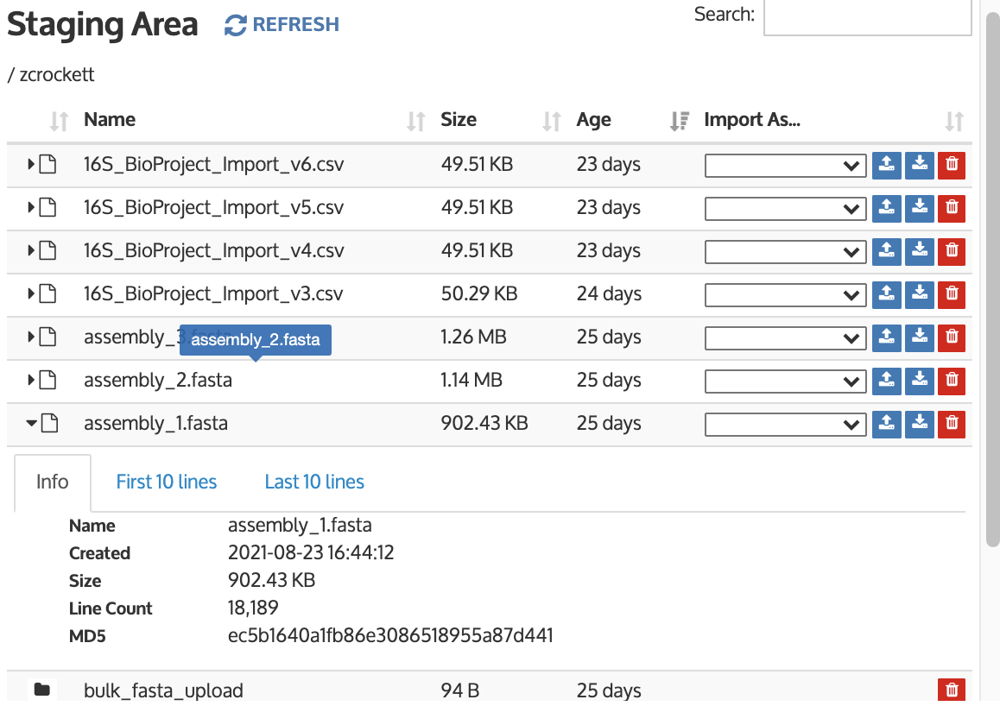

# Bulk Import Limitations

## Known Issues and Limitations

*   Issue: Only a single set of parameters can be used for a given type in a given bulk import.&#x20;

    Workaround: Subset your imports and run separate imports for each subset of data with a single set of parameters. Note that this only applies to parameters _within an import type_. For example, you have a set of Illumina reads, PacBio reads, and assemblies, you can import one of the sets of reads and the assemblies in one import, and the other type of reads in a separate import.
*   Issue: Staging Area allows uploading incomplete files, leading to data corruption.

    Workaround: This is an existing issue in the staging area that exists for single-file imports as well. Ensure files have fully uploaded and the file size in the Staging Area matches the size of the file from your machine. You can use MD5 checksums to verify the file uploaded correctly. You can view the MD5 inside the Staging Area by viewing the info for the file (_shown below_). Then, verify that the MD5 in the Staging Area matches the MD5 on your local machine using the following command depending on your operating system (replacing "assembly\_1.fasta" with your file name):

    * MacOS: `md5 assembly_1.fasta` &#x20;
    * Windows: `certutil -hashfile assembly_1.fasta md5`
    * Linux: `md5sum assembly_1.fasta`&#x20;

*   Issue: File paths are not autofilled.&#x20;

    Workaround: During import pairs of files that go together, such as pairs of non-interleaved FASTQ files or FASTA and GFF Metagenome files, will need to be manually assigned to a forward or reverse read.&#x20;

*   Scientific Name input disappears and becomes undefined within the input parameters when switching between tabs.&#x20;

    Workaround: This is a visual issue and the selected Scientific Name will still be included when running the import - even though it is not searchable in the _undefined state_.&#x20;

    To verify the selected name is correct when the parameter does switch to the undefined state, 1) search for and select a different scientific name, 2) click between Data type tabs, 3) return to Data type tab and search for and select the original, preferred scientific name, 4) then Run the import.&#x20;
*   Issue: Import fails after queuing due to illegal characters in the Data Object Name.

    Workaround: Check object names before running the import. An object name may only include alphabetic characters, numbers, and the symbols “\_”, “-”, “.”, and “|”. Remove any other non-alphanumeric character from the object name.
*   Issue: Job Status/Logs/Results do not appear or do not update.

    Workaround: There have been infrequent bugs found in which logs failed to appear, jobs reported as successful but no report could be generated, and similar issues. Switching between tabs or reloading the page has been found to fix these issues.
