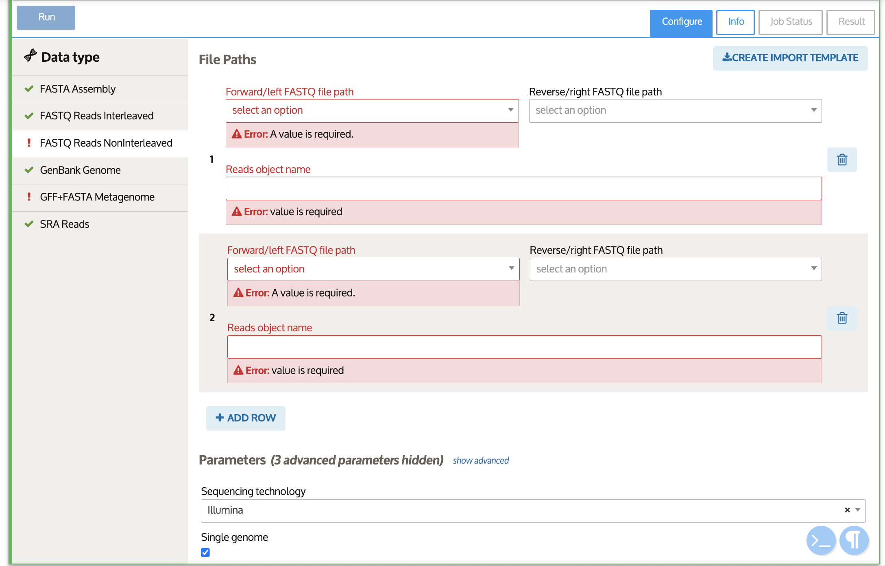

# Bulk Import Specification


Import using the Import Specification feature is still under development. The templates and process are subject to change prior to release.



A TSV (tab-separated values) file with a .tsv or .tab file extension, a CSV (comma-separated values) file with a .csv extension, or an Excel spreadsheet with a .xls extension can be used to upload multiple files at once. &#x20;

This approach treats the Import Specification file as a directory or manifest containing the upload information for multiple files to fill out an import cell. The TSV, CSV, or Excel file must be formatted exactly to import correctly.&#x20;


#### Import Specification files (TSV, CSV, Excel) require _several_ columns for uploading sequencing data when selecting files. These will vary for each data type, but make sure you have the following information:&#x20;

* **File Path(s)** – These will be relative to your home directory of the Staging Area, so you only need to include the file name if the files are at the top level. If they are within a folder called “folder1” then the file input fields should be "folder1/file1", "folder1/file2", etc.
* **Object name** – Designate an object name for the imported file, which will be the object name to use as the input for analysis Apps.
* **Parameters** – Any required input parameters.&#x20;


Use the bulk Importer App with a subset of files to generate an Import Specification template. Download and modify the template locally to fill out file paths and parameters. Then upload the Import Specification file to import all files at once.&#x20;


## Creating an import specification template from the Narrative

To create an import specification template CSV, TSV or Excel file for many files from the Narrative, begin with the Bulk Import directions using a subset of the files or file types to import.&#x20;

Drag and drop all files or a folder containing the files to upload to Staging.&#x20;

Once the files appear in the Staging Area, select at least one that represents each file type you wish to import, select the **Import As** file type and make sure the check box is active, then click "Import Selected."&#x20;

This will create a bulk Importer App in the Narrative. Fill out the parameters for the import. Then click the "Create Import Template" button. &#x20;

This will create a pop-up file to prompt the template creation. Select the import type(s), if multiple use key controls (such as command-hold and select with Mac or control-shift and select on Microsoft). Choose the output type as either Comma-separated (CSV), Tab-separated (TSV), or Excel (XLS). Then select or rename the output destination within the Staging Area. Click "Generate template!" to create the templates selected. &#x20;


If you have an Import Specification Template within the destination that you designate in the pop-up, it will be overwritten with the newly created template.&#x20;



To import multiple data types at once, either create a CSV/TSV for each type, or a tab for each type in a single Excel file.&#x20;


A pop-up will confirm the Import Specification template has been generated and its location in the Staging Area.&#x20;

Navigate back to the Staging Area  and click "Refresh" if you do not see the folder or template in the destination designated in the previous step. Download the Import Specification template using the download button on the left of the trash icon.

Open the Import Specification template. In the template files 3 rows are already filled; these are required for the staging service to parse the file. In the Excel file, the top two rows are hidden to simplify the view. The third row displays the column headers for inputs, outputs, and parameters included in the Importer App. The following rows are for each of the files to import, the files selected before will be included here.&#x20;

Continue filling out the spreadsheet as if you would the Importer App with the remaining files to import. Each row corresponds to one data object to import. Some data objects will include more than one file path. For instance, a GFF Genome requires both GFF and FASTA files. All text fields should match exactly to the display text in the Importer. Use the pre-filled parameters to fill out the rest of the rows with designated file paths.&#x20;


To manually fill in the Scientific name into a template, navigate to an Import cell with a GenBank Genome Data type. Under Parameters, go to the 'Scientific name', search for the genus/species name you want and select it. Click the copy button on the right. You can now paste the name into the template.&#x20;


## Importing a bulk Import Specification file

Open the [_Import_ tab within the **Data Browser**](../../getting-started/narrative/add-data.md)**.** Then drag & drop the Import Specification file and the files to be imported if they are not already in the Staging Area.&#x20;

Once the file appears in the Staging Area, select "_**Import Specification**_" from the dropdown in the _Import As..._ column. Make sure **only the Import Specification file is selected** with a filled checkbox (do not select the independent files). Click _**Import Selected**_ at the bottom right corner. &#x20;

Once the Import Specification file has been read, it will create a bulk Importer App in your Narrative and you can proceed as usual following[ the bulk import](uploads/#bulk-import-guide) directions. Verify the file names and import settings within the App. Click "Run" on the upper lefthand corner of the App to import the files from the Import Specification into the Narrative.&#x20;

Once the Importer App has run, the App will signal that the files have been imported or any errors that occurred across individual jobs.&#x20;

### Limitations

Currently, 500 rows or data objects per import is supported with good performance. The absolute limit is 10000 rows.&#x20;

If you upload an invalid file, you will receive an error that lists the problem encountered. For errors that can be fixed through the GUI, the Importer cell will be created but you must correct the error before running the import.

At this stage of development only a single set of parameters can be used per import job. While we plan to add multi-parameter support in the future and have made the Import Specification templates forward-compatible, the import will apply parameters from the first row to all files.&#x20;

_Troubleshooting tips:_

* Do not change the first 3 rows of the TSV or CSV file or the first row or hidden rows of Excel files. This will cause errors or incorrect data.&#x20;
* Be careful of stray cells in Excel - ensure that all the cells outside your data block are empty. Consider deleting all the rows and columns outside your data block.&#x20;
* For CSV and TSV files, be careful to always include the correct number of separator characters for every row, even if some values are blank. The importer is picky about this to help the user avoid off-by-one (or more) errors in their data.&#x20;
* Only one file or Excel tab is allowed per data type. Do not include rows for the same data type in more than one Excel tab, more than one file, a tab and an Excel file, etc.&#x20;
* In CSV and TSV files, white space around non-numerical data is ignored, and whitespace prior to numerical data is ignored.&#x20;
* In CSV and TSV files, you can use quotes (") to surround text that contains the separator character (respectively a comma or a tab).
* If individual files in an import specification are selected along with the import specification, a bug will occur where extra rows that cannot be filled in are added to the bulk import cell for the individual files. To workaround this issue, either do not select files that are within the selected import specification or delete the uncompletable row(s) from the import cell.
* If the scientific name lookup ignores spaces, the workaround is to create (and optionally delete) a new bulk import cell for the scientific name input.&#x20;
