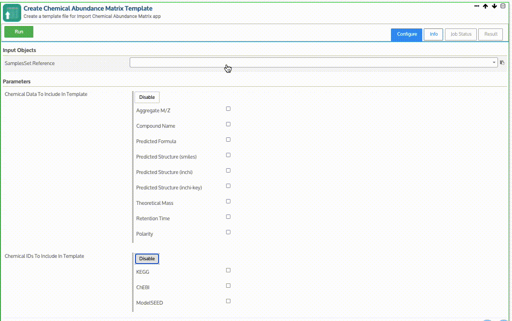
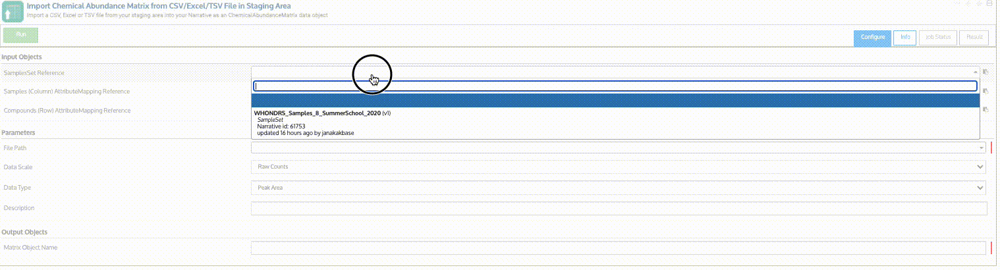

# Chemical Abundance Matrix

## What is "chemical abundance" in KBase?

The name of this data type “chemical abundance” is a broad term that we use to represent a wide array of measurements associated with chemicals. This data type can be used to upload and store diverse types of chemical data in the system such as metabolomics (intracellular and/or extracellular) that is derived based on microbiomes/isolate organism growth experiments etc., computationally predicted compounds, or data collected on the concentration or from elemental analysis. These data could be collected on environmental samples, such as soil, sediment, or water. Currently, the metabolomics data derived from the samples are the most popular data that is uploaded and stored in the system.

Once chemical abundance data matrices are [uploaded](chemical-abundance-matrix.md#uploading-and-importing), they can be analyzed using [KBase Apps for metabolomics](../../apps/analysis/metabolic-modeling.md#metabolomics), such as Escher mapping. Additional statistical analysis of the chemical abundance attribute maps, such as PCA and clustering, can also be performed.


A Chemical Abundance Matrix can be uploaded from a TSV (tab-separated values) file with a .tsv or .tab file extension, or from Excel spreadsheet with a .xls extension.

Each Chemical Type can be either a specific compound or element, aggregate (totals), exometabolites (measurements of compounds or elements that are consumed or excreted into the medium).&#x20;



Chemical Abundance Upload Webinar


## Formatting chemical abundance matrices

The [Create Chemical Abundance Matrix Template App](https://kbase.us/applist/apps/GenericsAPI/build\_chemical\_abundance\_template/release) creates an Excel spreadsheet for direct download that can be populated with chemical abundance data. While Chemical abundance data works best and more meaningful when linked with an existing SampleSet in the system, linking a SampleSet is not required (See section Linking SampleSet). While Chemical abundance data works best and more meaningful when linked with an [existing SampleSet](sampleset.md) in the system, linking a SampleSet is not required.

The minimal set of metadata in a chemical abundance matrix includes an ID (unique value) field, a chemical type (aggregate, exometabolite, specific), and one or more of the following:  Compound ID (e.g; ModelSEED, KEGG, ChEBI), mass, formula, inchikey, inchi, smiles, or compound name. Additional metadata such as units are strongly encouraged to provide with proper information that fits your scientific use cases or be kept as ‘unknown’.  (see section "Template Fields Descriptions" for an explanation of each field)  Providing additional metadata may enhance the downstream analysis of use cases for you and other readers.

If a SampleSet exists, it can be applied to the chemical abundance data. Chemical abundance data needs to be formatted to ensure Samples are correctly linked.

Note that linking to Samples is not required, but highly recommended. When linking to using this app, the template will be automatically populated with Sample IDs to ensure the chemical abundance data is properly linked to corresponding Samples in the system.

This App generates a spreadsheet onto which you can copy your data to ensure it links to the SampleSet when uploaded.&#x20;

When creating the chemical abundance template, there are 10 columns in the default sheet shown in the sheet below. Column headings in italics come pre-filled with validated values to choose form a dropdown.

| Column Heading          | Description                                                                                                                                                                                                                                                                                                                   |
| ----------------------- | ----------------------------------------------------------------------------------------------------------------------------------------------------------------------------------------------------------------------------------------------------------------------------------------------------------------------------- |
| ID (unique value)       | The identifier for the chemical/element/compound or peak value. This can be user-defined but must be unique for each compound.                                                                                                                                                                                                |
| _Chemical Type_         | <ul><li>Specific - Specific compounds in the sample (e.g; TiO2, Tyrosine) </li><li>Aggregate - Measurement of total concentration of individual elements (e.g; Total C, N) </li><li>Exometabolite - Measurements of compounds that are consumed or excreted into the medium by an organism or a microbial community</li></ul> |
| _Measurement Type_      | unknown, FTICR, Orbitrap, Quadrapole                                                                                                                                                                                                                                                                                          |
| _Units_                 | mg/Kg, g/Kg, mg/L, mg/g DW, mM (millimolar), M (molar), % (percentage), Total Weight  %, unknown                                                                                                                                                                                                                              |
| _Unit Medium_           | soil, solvent, water                                                                                                                                                                                                                                                                                                          |
| Chemical Ontology Class | Used for grouping chemicals by their functional groups (e.g; aromatics) or could use according to ontologies defined in public databases (e.g; ChEBI).                                                                                                                                                                        |
| _Chromatography Type_   | unknown, HPLC, MS/MS, LCMS, GS                                                                                                                                                                                                                                                                                                |
| Chemical Class          | Used for defining major classes like lanthanides                                                                                                                                                                                                                                                                              |
| Protocol                | Any term or sentence defining the protocol used in your lab                                                                                                                                                                                                                                                                   |
| Identifier              | An optional identifier/abbreviation that you use for the compound and or element (e.g; Menaquinone => MK-8, Fatty acid => (Iso-C16:1) )                                                                                                                                                                                       |

Select chemical data to include, such as aggregate M/Z, compound name, predicted formula, and more, depending on what data you have for upload.&#x20;

| Column Heading                  | Description                                                                                                                                                                                                                                                                                                                                                  |
| ------------------------------- | ------------------------------------------------------------------------------------------------------------------------------------------------------------------------------------------------------------------------------------------------------------------------------------------------------------------------------------------------------------ |
| Aggregate M/Z                   | M/Z represents the ratio of mass (M) divided by net charge (Z) of the chemical.                                                                                                                                                                                                                                                                              |
| Compound Name                   | Optional name for the compound                                                                                                                                                                                                                                                                                                                               |
| Predicted Formula               | Formula of the compound (if available). The formula could be a predicted formula based on techniques such as Fourier-transform ion cyclotron resonance (FTICR) mass spectrometry, computationally predicted formula based on molecular weight, derived from instruments based on known protocols, or based on the chemical structure determination from NMR. |
| Predicted Structure (smiles)    | Predicted structure using Simplified Molecular Input Line Entry System (SMILES) notation                                                                                                                                                                                                                                                                     |
| Predicted Structure (inchi-key) | Predicted structure using International Chemical Identifier (InChi) key notation.                                                                                                                                                                                                                                                                            |
| Theoretical Mass                | Theoretical molecular mass of the compound                                                                                                                                                                                                                                                                                                                   |
| Retention Time                  | The retention time of the chemical; not validated, so users can include units or not depending on needs                                                                                                                                                                                                                                                      |
| Polarity                        | Polarity of the chemical.                                                                                                                                                                                                                                                                                                                                    |

Finally, select at least one form of standard Chemical IDs to include in the template. These can be selected from the [KEGG](https://www.genome.jp/kegg/compound/), [ChEBI](https://www.ebi.ac.uk/chebi/), and [ModelSEED](https://modelseed.org/biochem/compounds) databases. You can use their respective websites to get the identifier for your compound. If you are creating a chemical abundance sheet from scratch, you don't have to include one of these chemical IDs, but it is recommended that you do so in order to compare similar chemical once uploaded.


If you plan to use your data with metabolic modeling analysis pipelines (see Use cases section) we highly encourage to have at least one type of identifier to be listed (if available), as the compound identifiers will be used to map compounds in metabolic models. (Alternatively, you can provide inchikeys which we able to map to compounds in metabolic models).


## Uploading and Importing

&#x20;For full functionality of analysis tools using metadata, first [upload and import the SampleSet](sampleset.md).&#x20;

Once you have added and [formatted](../samples/ontology.md) your data to the Chemical Abundance Matrix template, you can upload it using the [Import Chemical Abundance Matrix from CSV/Excel/TSV File in Staging Area App](https://narrative.kbase.us/#catalog/apps/GenericsAPI/import\_chemical\_abundance/release).&#x20;

Using a file on your computer, open the [_Import_ tab within the **Data Browser**](../../getting-started/narrative/add-data.md)**.** Then drag & drop the chemical abundance matrix file into the Staging Area.

Once the matrix is in your Staging Area, you can import the data into your Narrative.

In the first section for Input Objects, select the previously imported SamplesSet file from the dropdown menu for linking metadata.&#x20;

Under Parameters, select the Chemical Abundance Matrix using the FilePath dropdown.&#x20;

Fill in the Matrix Object Name and click the "Run" button to add the metabolomics data to the Narrative.

## Using the Uploaded Data

Once you've uploaded your chemical abundance data, you can explore apps using that type of data or use one of our use case demonstration Narratives. See [the chemical abundance section of in Using Apps for more info.](https://docs.kbase.us/apps/analysis/chemical-abundance)
