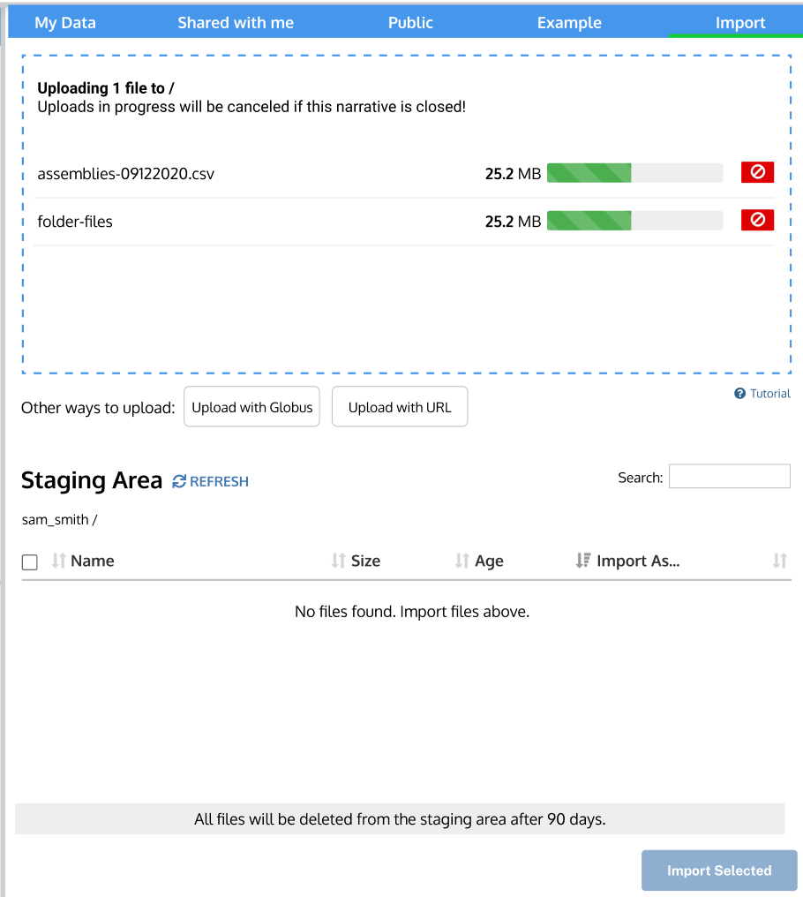
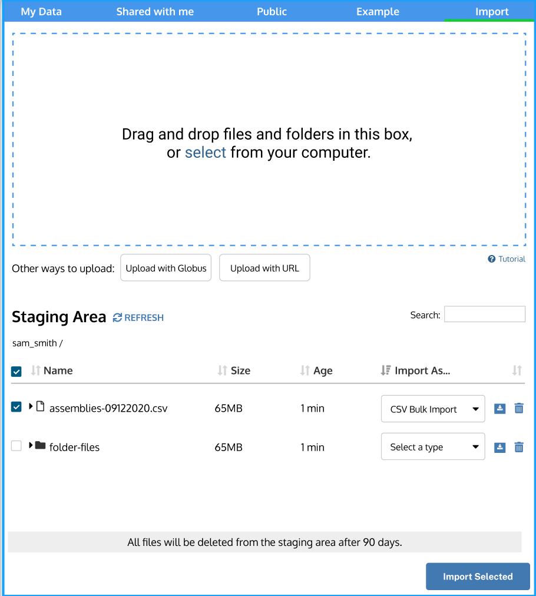
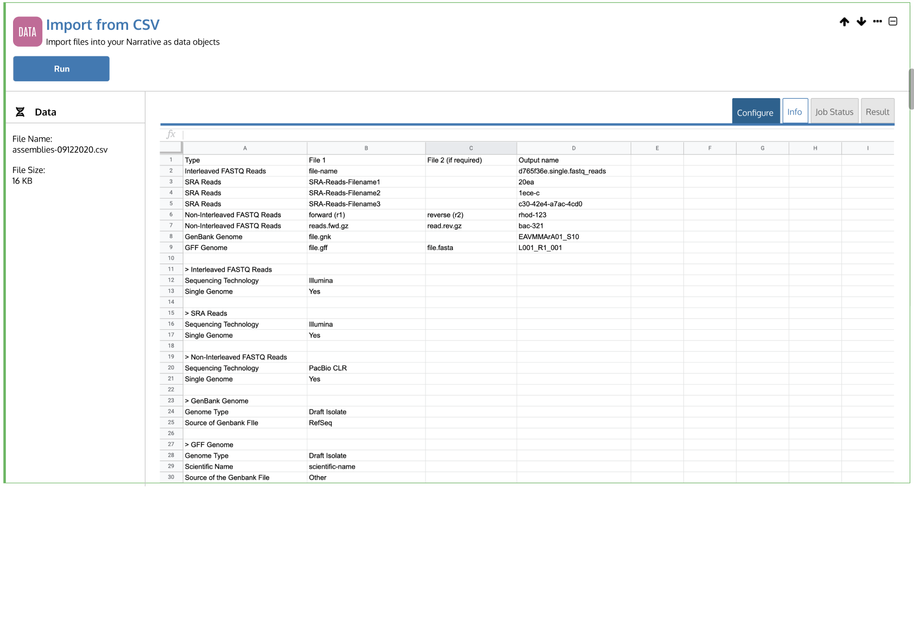
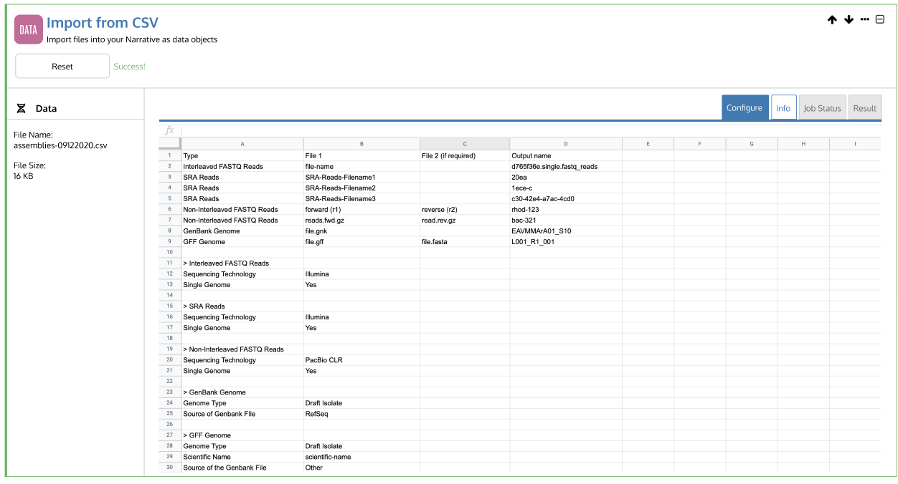
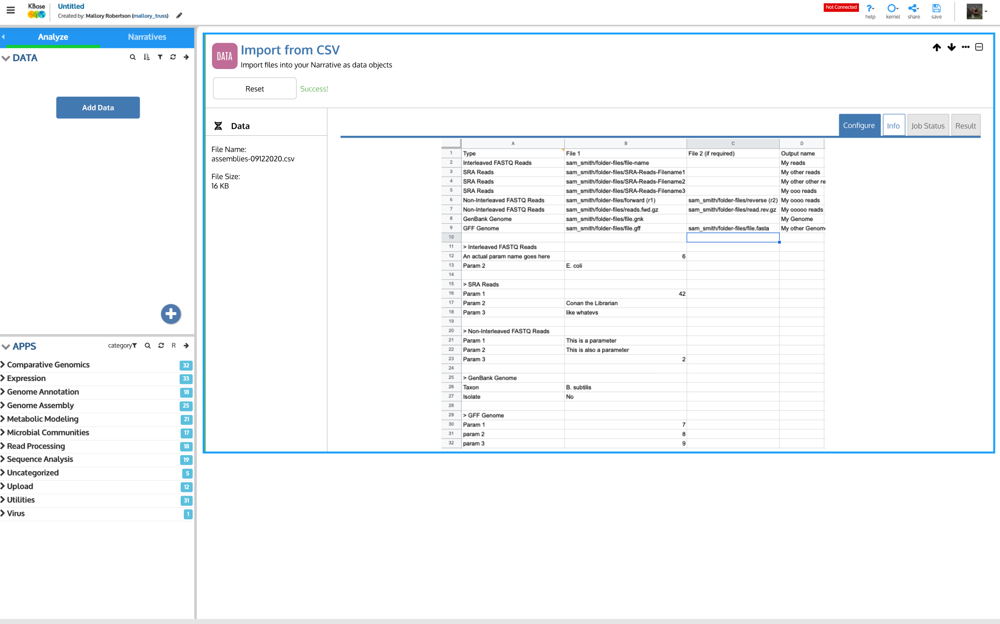

# CSV - prototyping

#### Prototyping and Usability: If you are interested in being a usability tester and providing feedback on the Narrative interface, fill out [this google form](https://docs.google.com/forms/d/e/1FAIpQLSdFJT3vAR0DR8UZir29nhFujCh-B0AXczhw6oylht7r9JVPRQ/viewform). 

## File formatting

Using a CSV to upload treats the CSV as a directory containing the upload information for multiple files. The CSV must be formatted exactly for the importer to interpret it correctly. The CSV requires four columns. The first column name indicates if the row denotes a file or files to be read or parameters for the import. 

For example, if you wanted to import a pair of non-interleaved FASTQ reads test\_R1.fastq and test\_R2.fastq as an object called test\_reads, you would have a row to select the files and another row for each the parameters, e.g.,

<table>
  <thead>
    <tr>
      <th style="text-align:left">
        

        
Non-interleaved FASTQ Reads

      </th>
      <th style="text-align:left">test_R1.fastq</th>
      <th style="text-align:left">test_R2.fastq</th>
      <th style="text-align:left">test_reads</th>
    </tr>
  </thead>
  <tbody>
    <tr>
      <td style="text-align:left">Non-interleaved FASTQ Reads</td>
      <td style="text-align:left">Sequencing Technology</td>
      <td style="text-align:left">PacBio CLR</td>
      <td style="text-align:left"></td>
    </tr>
    <tr>
      <td style="text-align:left">Non-interleaved FASTQ Reads</td>
      <td style="text-align:left">Single Genome</td>
      <td style="text-align:left">Yes</td>
      <td style="text-align:left"></td>
    </tr>
  </tbody>
</table>

#### CSV files require _four_ columns for uploading sequencing data when selecting files: 

1. **File Type** - In the first column, include the file type, which can be SRA Reads, Interleaved FastQ Reads, Non-interleaved FASTQ Reads, GenBank Genome, and GFF Genome. 
2. **File 1** - This column should be the name of the file including the extension and the path to the file, if it is different from the CSV. 
3. **File 2** \( as needed\) - If a second file is needed, for instance when importing a .gff or non-interleaved reads. Use the same format of file name and extension. 
4. **Output name** - The fourth column is reserved to include the output for the reads object, which will be the object name to use as the input for analysis Apps. 

#### For _parameters_, there should be _three_ columns:

1. **Importer type -** In the first column, declare which importer app the parameter applies to.
2. **Parameter Name -** The second column is used to indicate which parameter defined on the row
3. **Parameter Value -** The third column indicates the value of the parameter

Using CSV, files of multiple types can be imported simultaneously, provided the correct formatting is used, e.g.,

| Type | File 1 | File 2 \(if required\) | Output name |
| :--- | :--- | :--- | :--- |
| SRA Reads | sam\_smith/folder-files/file.sra |  | sra\_reads |
| Interleaved FASTQ | sam\_smith/folder-files/file.fastq |  | fastq\_reads |
| Non-Interleaved FASTQ | sam\_smith/folder-files/forward.fastq | sam\_smith/folder-files/reverse.fastq | fastq\_F\_R |
| GenBank Genome | sam\_smith/folder-files/file.gbk |  | genome\_gbk |
| GFF Genome | sam\_smith/folder-files/file.gff | sam\_smith/folder-files/file.fasta | genome\_gff |
| Media File | sam\_smith/folder-files/file.tsv |  | media\_tsv |

### Download a template and example of a valid import CSV: 



## Importing a CSV file from your computer

Open the Data Browser slide-out by either clicking the Add Data or Plus buttons in the DATA Panel. Then Drag & Drop the .csv file along with the files to be imported into the drop box.

Once the file appears in the Staging Area, click the check box next to the file name to select it. Click Import Selected at the bottom right corner.  

This will open the Import from CSV App. In the App, you can see the contents of the CSV file within the App to verify the file names and import settings. Click "Run" on the upper lefthand corner of the App to import the files from the .csv to the Data Panel. 

​

​

Once the Importer App has run, the App will signal that the files have been imported. 

