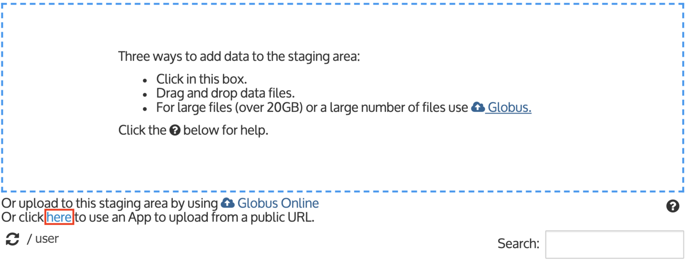

# Genome

In KBase, a **Genome object is the annotated version of an Assembly** and can encompass several types of feature calls. If you want to upload solely the DNA sequence from a FASTA file \(without annotations\), go to the [Assembly](assembly.md) page.

The Genome importer supports only GenBank and GFF-formatted files. A GenBank-formatted input file should include sequence contig\(s\), feature calls \(annotations\), and taxonomy information for the organism. KBase parses the input file into two data objects: an assembly object with the sequence and a genome object containing the original feature calls and annotations.

GenBank-formatted files with no features can be uploaded as Genomes but they aren’t very informative until annotated with a KBase app. Genomes with annotation can be used as input for several KBase analyses.

A GenBank-formatted file can be uploaded into the Staging Area from your local computer \(files with.gb, .gbff, or .gbk extensions\) or directly from an FTP or HTTP URL.

A GFF-formatted file must be paired with a corresponding FASTA file of the DNA sequence. These  will be parsed into two data objects: an assembly object with the sequence and a genome object containing the original feature calls and annotations.

Further instructions for adding data to your Staging Area can be found [here](../../getting-started/narrative/add-data.md#uploading-data-from-external-sources).

## Importing a GenBank-formatted file from your computer

For this example, we will use the _E. coli_ K-12 MG1655 genome GenBank file from NCBI. By clicking on the following link you can download the _E. coli_ K-12 MG1655 genome to your computer: [ftp://ftp.ncbi.nlm.nih.gov/genomes/archive/old\_refseq/Bacteria/Escherichia\_coli\_K\_12\_substr\_\_MG1655\_uid57779/NC\_000913.gbk](ftp://ftp.ncbi.nlm.nih.gov/genomes/archive/old_refseq/Bacteria/Escherichia_coli_K_12_substr__MG1655_uid57779/NC_000913.gbk)

After downloading the file, open the __[_Import_ tab in the **Data Browser**](../../getting-started/narrative/add-data.md) and drag the genome file into your Staging Area.

### **Drag & Drop Limitations**

The drag & drop option from your local computer works for many files, but there is a size limit that depends on your computer and browser. For larger files \(around 20 gigabases\), use the [Globus Online transfer](../globus.md). Open the _Import As..._ pulldown menu to the right of the filename in your Staging Area and select “GenBank Genome.”

Click the import icon \(up arrow\) to the right of “GenBank Genome.” The Data Browser will close and an app called “Import GenBank File as Genome from Staging Area” will be added to your Narrative.

Notice that the name of the Genome file is filled in, as is a suggested name for the Genome and Assembly data objects that will be created by the import, which _can_ be changed. Adjust the source of the GenBank file or any of the advanced options if needed, then click the green "Run" button to start the import. When the import is finished, your **Data Panel** will update to show the new Genome and Assembly objects, and a report will appear in the import app cell.

## Import a GenBank-formatted file from other sources

In the Staging Area, beneath the box for Drag & Drop, are other options for getting data.

You can import data into your KBase workspace using [Globus](../globus.md), or by supplying a URL for a publicly accessible FTP location, Google Drive, Dropbox, or a direct HTTP link. Options for adding data to the Staging Area are described [here](../../getting-started/narrative/add-data.md).

## Uploading a GFF file to your Staging area from an FTP link

For this example, we use the _E. coli_ K-12 MG1655 genome GFF and FASTA files from NCBI.

Open the _Import_ tab in the **Data Browser** and click on the blue "here" link \(below the drag & drop area\) to open an upload app.

The Data Browser will close and the app called “Upload a File to Staging from Web” will appear in your Narrative. Alternatively, you can open the app directly from the **Apps Panel**. From the app, click on the dropdown for the URL Type and select ‘FTP Link’.

We will use the following two links for the GFF and FASTA files:  
[ftp://ftp.ncbi.nlm.nih.gov/genomes/all/GCA/000/005/845/GCA\_000005845.2\_ASM584v2/GCA\_000005845.2\_ASM584v2\_genomic.gff.gz](ftp://ftp.ncbi.nlm.nih.gov/genomes/all/GCA/000/005/845/GCA_000005845.2_ASM584v2/GCA_000005845.2_ASM584v2_genomic.gff.gz)  
[ftp://ftp.ncbi.nlm.nih.gov/genomes/all/GCA/000/005/845/GCA\_000005845.2\_ASM584v2/GCA\_000005845.2\_ASM584v2\_genomic.fna.gz](ftp://ftp.ncbi.nlm.nih.gov/genomes/all/GCA/000/005/845/GCA_000005845.2_ASM584v2/GCA_000005845.2_ASM584v2_genomic.fna.gz)

In the upload app, click the "+" button for the URLs and paste in the name of the GFF file. Hit the "+" button again and paste in the name of the FASTA file.

Then click the green "Run" button to start the upload. After the app completes the files will appear in your Staging Area, which you can access via the _Import_ tab in the **Data Browser**.

## Importing a GFF and FASTA file from the Staging Area

The GFF and FASTA files are now in your Staging Area. Now you need to import them to your Narrative to use them in analyses.

In your Staging Area, open the _Import As..._ pulldown menu to the right of the GFF filename and select “GFF Genome."

Copy the name of the FASTA file as it will be needed shortly.

Now click the import button to the right of “GFF Genome”. The data slide-out will close and an app called “Import GFF/FASTA File as Genome from Staging Area” will be added to your Narrative. The GFF File Path name will be filled in.

You will need to fill in the name of the FASTA file. In the line for “FASTA File Path”, type or paste in the name of the FASTA file copied from the Staging Area. The FASTA file name is similar to the GFF file name and can be copied from the GFF File Path and pasted in the FASTA line. Ensure the file type is a FASTA file type. 

Notice that the name of the Scientific Name is filled in, as is a suggested name for the Genome data object that will be created by the import. You can edit the name of the output Genome Object Name, Scientific Name, and any advanced options as needed. When ready, click the green "Run" button. When the import is finished, your Data Panel will update to show the new Genome object, and a report will appear in the import app cell.

## 

