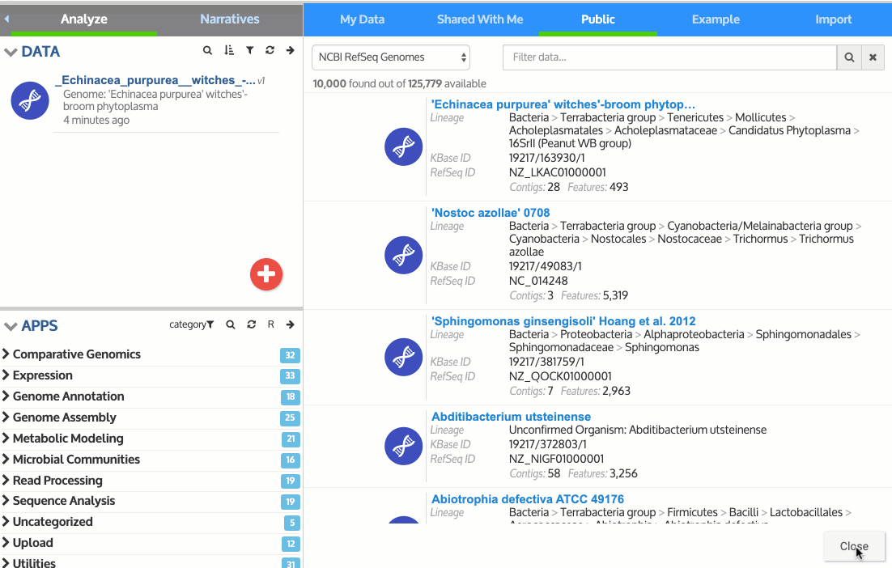
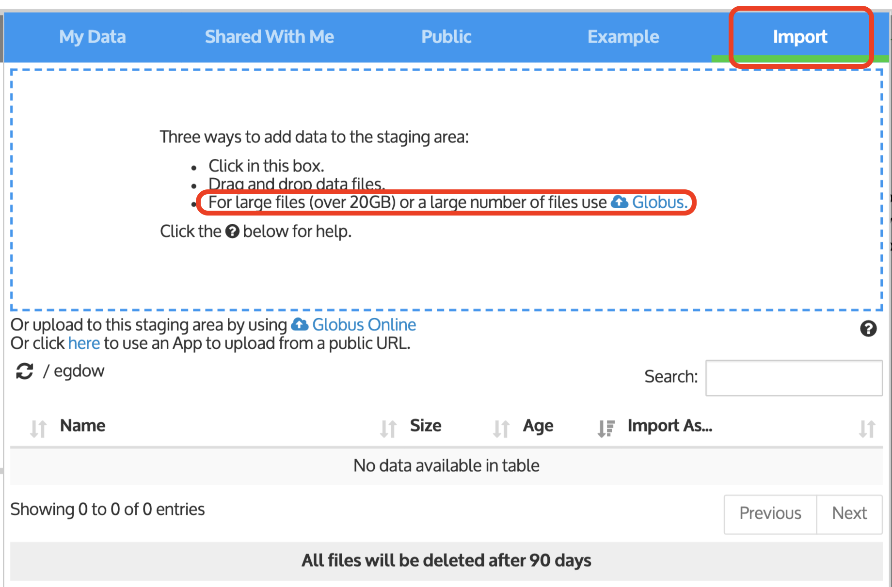

# Uploading Data

## Importing Data using the Data Browser

The _Import_ tab lets you drag & drop data files from your computer into the Staging Area to upload data into your Narrative. Visit [this page](../../getting-started/narrative/add-data.md#uploading-data-from-external-sources) of the Narrative User Guide for general instructions on how to use the Staging Area.

The first step in uploading your data is to locate the **Data Panel** along the left side of the Narrative Interface window and click the red “Add Data” button, the circular red “+” icon, or the arrow at the upper right of the panel to access the slide-out **Data Browser**. The Data Browser has several tabs that allow you to access data within KBase and the _Import_ tab for uploading your own data. 

To close the Import panel and return to the Narrative Interface, simply click the “Close” button on the bottom right of the import panel. 

If you have a small screen, you might not be able to see that button. Another way to close the Data Browser is to click the arrow icon on the top right of your Data Panel \(the same one that opens the Data Browser slide-out\).

## **Drag & Drop Limitations**

The drag & drop from your local computer works for many files, but there is a size limit dependent on your computer and browser. For larger files around 20GB, use the [Globus Online transfer](../globus.md).

## **Data Privacy**

Any data you upload to KBase is private unless you choose to share it. You can share any of your Narratives \(including their associated data\) with one or more specific users, or make it publicly available to all KBase users. Please see the [Share Narratives](../../getting-started/narrative/share.md) page for more information and how to share data and Narratives. The [Terms and Conditions page](http://kbase.us/terms-and-conditions/) describes the KBase data policy.

The next sections of this guide describe the specific steps involved in uploading the currently supported data types, and show examples for each type.

## **Transferring JGI data to KBase**

If you are a JGI user, you can transfer public genome reads and assemblies \(including your private data and annotated genomes\) from JGI to your KBase account—see [this page](../jgi-transfer.md) for instructions.

