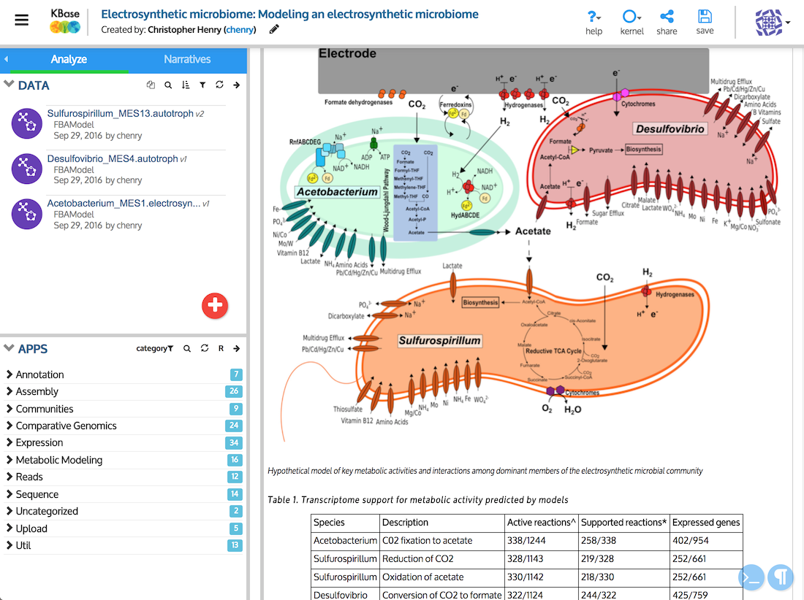

# About This Guide

This is the user guide for the Narrative Interface, the graphical user interface for accessing KBase’s functionality and data. If you are looking for a very quick \(one-page\) introduction to the Narrative Interface, please see the [Narrative Quick Start](../narrative-quick-start.md).

## What is the Narrative Interface?

The Narrative Interface enables researchers to design and carry out computational experiments while creating interactive, reproducible records of the data, computational steps, and thought processes underpinning their results. These records can be shared with collaborators and published as **“active papers,” called Narratives,** that let others repeat the computational experiment and even alter parameters or input data to achieve different or improved results. The Narrative Interface is built on top of the [Jupyter Notebook](http://jupyter.org/) framework.

