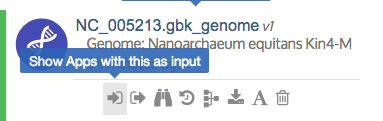

# Add Data to Your Narrative

Now that you are familiar with ways to find and explore data in KBase, you can select or upload data to analyze. The **Data Panel** in a Narrative shows the data objects that are currently available in that particular Narrative. From the Data Panel, you can access the data slide-out, which allows you to search for data of interest and add it to your Narrative. In the Data Panel, click the red "Add Data" button, the red “+” button, or the right arrow at the upper right of the panel to access the **Data Browser** slide-out.


**Data Privacy**  
Any data that you upload to KBase is kept private unless you explicitly choose to share it. You can share any of your Narratives \(including their associated data\) with one or more specific users, or make it publicly available to all KBase users. Please see the [Sharing](share-narratives.md) page for more information about how to do that. The [Terms and Conditions page](https://kbase.us/terms-and-conditions/) describes the KBase data policy.


The first four tabs of the Data Browser \(“My Data”, “Shared With Me”, “Public”, and “Example”\) let you search data that is already in KBase. The _Import_ tab lets you import data from your computer to your Narrative so that you can analyze it in KBase.

* The _My Data_ tab shows data objects that you have added to your project. You may need to refresh this tab to see your most recently added data.
* The _Shared With Me_ and _Public_ tabs display datasets that others have loaded and made accessible to you \(or to everyone\). Data within each group is searchable and can be filtered. Since there are a large number of public datasets, you may wish to filter them by data type \(using the pulldown selector on the left\) or narrow the list by searching \(in the “Search data” text box\) for specific text in the data objects’ names.
* The _Example_ tab shows datasets that have been pre-loaded for use with particular apps. These can be handy for trying out the Narrative Interface.
* The _Import_ tab allows you to upload your own datasets for analysis. This is explained in more detail below.

## Data available in KBase

If you hover your cursor over any data object under the first four tabs, options will appear allowing you to add that object to your Narrative or find out more about it.

In the [previous section](explore-data.md), we described the process of adding a genome to your Narrative from the public data in KBase. Now let’s check out the different data types available under the _Example_ tab. The icon to the left of each data object represents its data type.

As described in the previous section, the blue "&lt; Add" button next to these icons lets you add the data object to your Narrative. You can add more more data to your Narrative from the _Example_ tab to try out various KBase apps.

## Uploading data from external sources

The _Import_ tab lets you drag & drop data from your computer into your Staging Area to import into your Narrative, where you can then analyze it using KBase’s analysis apps.

To upload data from your computer \(or a [Globus endpoint](../../working-with-data-1/transferring-data-with-globus.md) or URL\), choose the rightmost tab of the Data Browser to open the _Import_ tab.

You can then click the “?” icon just below the drop zone to the right to launch a short interactive tour that shows the different parts of this user interface.

Getting data from your computer to your KBase Narrative is a three-step process:

1. Drag and drop the data file\(s\) from your computer to the new Import tab to upload them to your Staging Area.
2. Choose a format for importing data from your Staging Area into your Narrative.
3. Run the Import app that is created.


**What is a Staging Area?**  
Your Staging Area is a sort of “halfway house” for your uploaded data files. It is private to you–no one else can see the data in your Staging Area. The files in your Staging Area stay there and can be seen from any of your Narratives. When you’re ready to add data to a Narrative, you can choose a data type from the pulldown menu next to a data file in your staging area in order to add it to your Narrative as an object of that type–see below for instructions.



**Why have a Staging Area?**  
It’s more robust and extensible this way. Unlike our previous importer, the staging upload can handle large data files without timing out. The user interface is more intuitive: you can drag and drop one or more data files into your Staging Area, or even whole directories or zip files. Finally, the new importer is easier for our developers to extend to new data types.



**What's the difference between 'Upload' and 'Import'?**  
In this documentation, we will use “Upload” to refer to getting data from your computer into your Staging Area and “Import” to refer to the process of converting a data file from your Staging Area into a data object in your Narrative that you can analyze with any of our analysis apps. Sometimes we use the term “Import” to cover the whole Upload+Import process.


## Drag & drop data files into your Staging Area


**Drag & Drop Limitations**  
The drag & drop from your local computer works for many files, but there is a size limit that depends on your computer and browser. Some users have reported problems around 20 gigabases. For larger files, use the [Globus Online transfer](../../working-with-data-1/transferring-data-with-globus.md).


Find the file\(s\) you want to import into your KBase account, and drag them into the drop zone \(the rectangular area surrounded by a dashed line\). You can select multiple files from your computer and drag them all at once. \(In the example below, the user is dragging two files into the dashed area.\) You can also select a folder of data files and drag the folder into the Staging Area drop zone.

If you don’t like using drag & drop, you can instead click in the upload area to open a file chooser and select a file from your computer to upload.

While files are being uploaded to your Staging Area, you’ll see a green progress bar.

When the file is done uploading, you will see it appear in the list of files in your Staging Area. \(If you don’t see your file, try clicking the reload icon on the left above the file list to refresh the view.\) By default, these are sorted by age, with the most recently uploaded file at the top. To sort the list by other fields, such as name or size, click a column header.


**90-day lifetime for files in your Staging Area**  
Your Staging Area is meant to be a temporary holding area for data you want to import into your KBase account. After adding files to your Staging Area, be sure to import them into your Narrative soon, as files in the Staging Area are automatically removed after 90 days. \(Data objects that you have imported to your Narrative last indefinitely.\)


## Transferring data from a Globus endpoint

Globus is a data management and file transfer system that can facilitate bulk transfer of data \(either large data files or a large number of files\) between two endpoints. The endpoints that apply here are KBase, JGI, and your local computer. The KBase endpoint is called “KBase Bulk Share,” and JGI has their own way to link to Globus. To do any transfer using Globus, you will [need a Globus account](https://www.globusid.org/create).

See [Transferring Data with Globus](../../working-with-data-1/transferring-data-with-globus.md) for more documentation on using Globus.


**Uploading data from JGI**  
If you are a JGI user, you can transfer public genome reads and assemblies \(as well as your private data and annotated genomes\) from JGI to your KBase account—see [the JGI data transfer page](../../working-with-data-1/transferring-data-from-jgi.md) for instructions.


## Uploading data from a URL

Below the link to Globus, another link says “Click here to use an App to upload from a public URL” \(for example, a GenBank ftp URL, or a Dropbox or Google Drive URL that is publicly accessible\).

Clicking this link adds the “Upload File to Staging from Web” app to your Narrative:

There are also several apps that import specific file types \(single- or paired-end reads or SRA files\) from a URL directly to your Narrative, bypassing your Staging Area. These are available from the Apps Panel and the [App Catalog](https://narrative.kbase.us/#appcatalog).

## Importing files from the Staging Area to the KBase Narrative

The files in your Staging Area are ready to import into your Narrative as KBase data objects that can be used in your analyses. To import a file from your Staging Area, choose a format \(data type\) from the pulldown menu to the right of the file’s age. \(You can find out more about KBase data types and accepted formats in the [Upload/Download Guide](../../working-with-data-1/data-upload-download-guide/).\) Then click the import icon to the right of the format menu.

When you click the import icon, the Data Browser slides shut and an Import app cell \(tailored to the chosen format\) is created in your Narrative, with the appropriate parameters filled in. For example, here’s an import app created by choosing “GenBank” as the import format:


**Importing different types of data**  
This example shows how to import GenBank data. Please see the [Upload/Download Guide](../../working-with-data-1/data-upload-download-guide/) for detailed instructions for other supported data types.


If the GenBank file came from a different source, use the pulldown menu to select it. You can change the output object name, if desired, and then click the "Run" button to start the import. When the import is done, you should see the message “Finished with success” near the top of the app cell, and some information about the app run.

If you look at your Data Panel, you should see the new data object created by the import.  

You can now use this data object as input into the relevant KBase apps. If you want to see which apps accept a particular data type as input, you can click the “…” menu in the data object cell that appears when you hover over it, and then use the “Show Apps with this as input” icon to filter the apps in the Apps Panel.


**What if my import fails?**  
Sometimes an import doesn’t work. One of the most common causes of failure is attempting to import a file that’s the wrong data type, or not the expected format for that data type. For example, the screenshot below shows what a user got when they tried to import a GenBank file as Media.


If the importer objected to something in your file, check the [Data Upload/Download guide](../../working-with-data-1/data-upload-download-guide/) for details about the relevant format.

  
In some cases, the cause of an import error will not be obvious. If you can’t figure out why your import isn’t working, please contact us \(via the [Help Board](https://kbase.us/help-board/)\) for help. Note, however, that no one besides you has access to your Staging Area, so we will not be able to see the files you uploaded to your Staging Area. You may need to attach your input file to your Help Board ticket in order for us to diagnose the problem.

## Getting more information about files in your Staging Area

The list of files in your Staging Area includes their name, size, and age \(from when they were uploaded\). If you have a lot of files in your Staging Area, you may want to use the Search box to locate specific files.

Compressed or zipped files have a little double-arrow icon next to the filename. You can click that icon to unpack these files. For how to upload and import file types, follow [this guide](../../working-with-data-1/data-upload-download-guide/compressed-zipped-files.md). 

For more information about a file in your staging area, click the arrow to the left of the filename to open a tab like this:

You can click “First 10 lines” or “Last 10 lines” to see that portion of the file:

Opening the information about a file in your Staging Area also reveals a trash can icon that allows you to remove the file from your staging area.  
  
You will be asked to confirm that you want to delete the file. This action is not reversible.

  
Note that if you had already imported the file to your Narrative as a data object, that object won’t go away when you delete the file in your Staging Area. If you want to delete a data object, you can do that in your Data Panel.


**In progress**  
KBase’s import functionality and user interface are under active development. We [welcome your bug reports and suggestions](../../troubleshooting-1/how-to-report-issues.md) for future upload functionality.


## Now what?

Once you have added data–your own data or reference data that is already in KBase–to your Narrative, you will be ready for the exciting part: analyzing it! The next two sections describe how to [choose](browse-kbase-analysis-tools.md) and [run an app](analyze-data-using-kbase-apps.md) to analyze your data.

