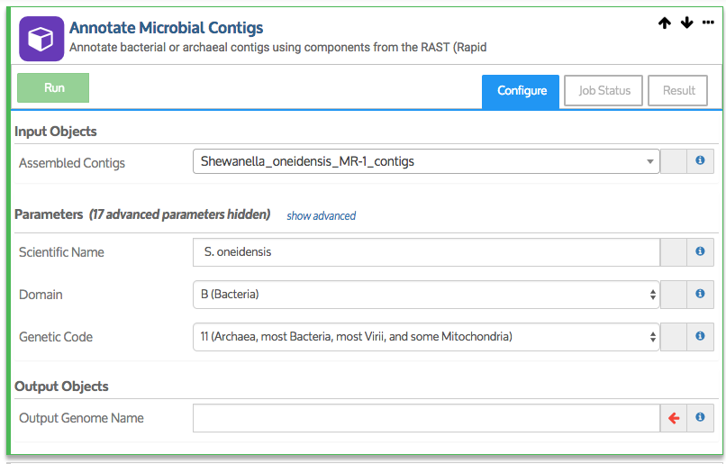
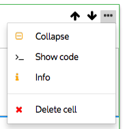
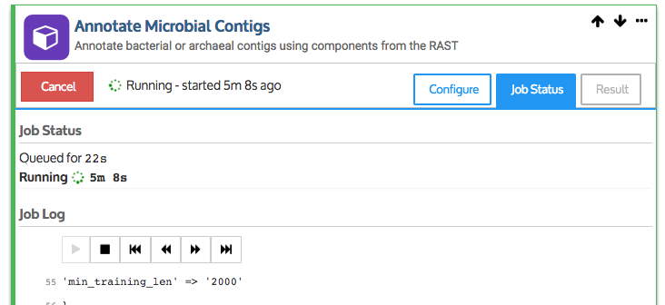
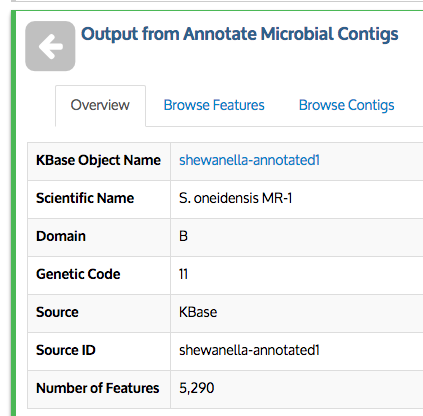
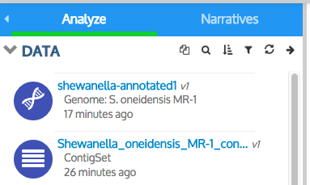
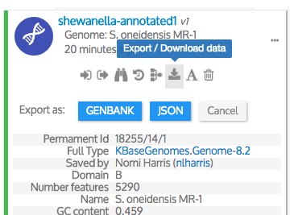

# Analyze Data Using KBase Apps

Now that you have explored the available apps and determined which ones work with the data objects in your Narrative, you can begin analyzing your data.

## Add an app to your Narrative

To add an app to your Narrative, find the app of interest and click its name or the icon to the left of the app name. A box \(called a _cell_\) containing the chosen app will appear in the main Narrative panel.

A few things to notice about the app cell:

* App cells have three tabs: Configure \(which is where you set the parameters; it’s what you see when you add a new app cell\), Job Status and Result. The last two tabs are filled in once you run the app; these are discussed later.
* The up and down arrows let you move the cell up or down in your Narrative.

  

* The “…” menu offers several options for collapsing/expanding the cell; showing the code that will execute the app; getting more info \(in a separate browser window\) about the app; and deleting the cell. These are discussed more in the section called “[Revise Your Narrative](revise-your-narrative.md)“.
* Every app has some parameters \(fields\) that must be filled in before you can run the app.

## Fill in parameters

After you add an app to your Narrative, the required parameters must be filled in before you can run it. For example, for most apps, you will need to select the input data object\(s\). Other parameters may also need to be set. A red arrow to the right of a field indicates that it is a required field and you have not yet entered a valid value in it. Once you enter a value, the red arrow should disappear.

Some app fields are “smart” and know which data in your Narrative is valid for that field. These “smart” fields have a pulldown list of data objects that you can choose from. \(Remember, only data \(of the appropriate type\) that you have already added to this particular Narrative will be shown in that list. You can access your data from other Narratives via the My Data and Shared with me tabs in the [Data Panel](add-data-to-your-narrative.md).\)

In the example app shown above, the input object field, which is required, has a pulldown list that will be populated with data objects of the appropriate type that you have added to your Narrative. Scientific Name, on the other hand, is a free text field and is optional. The next two fields \(Domain and Genetic Code\) are also required, but they are pre-filled with default values. You could change their values if you chose, or leave them as they are. Finally, the last field \(Output Genome Name\) is another free text field. In the screenshot, the Output Genome Name, is not yet filled in; it has a red arrow to the right. The Run button is not enabled until all required fields are filled in and the red arrows are gone.

Some apps have optional “advanced options” that you can reveal by clicking on the “advanced options” link at the bottom of the cell.

**Save Your Work**

As you add to your Narrative, be sure to save your work frequently, using the Save button at the top right of the screen.

## Run the app

When you have filled in all the required fields, the _Run_ button on the left side of the app will be enabled; click it to start running the app. Once clicked, the green _Run_ button will turn to a red _Cancel_ button. When the analysis starts running, you will see information in the _Job Status_ tab_**.**_

Depending on the analysis, the analysis might finish within a few seconds or could take hours to run. You can save your Narrative and come back to it later–the analysis will continue running even if you don’t have the Narrative open.

**Examine and download results**

When an app finishes running, you will see a summary in the Results tab, as well as an output cell below your app cell. Also, if the analysis generates a new data object, that object will be added to your Data Panel.

In the example, the “Annotate Microbial Contigs” app, once run, produced an output cell that provides information about the newly annotated Shewanella genome object.

This output cell has three tabs: Overview \(displayed above\), _Browse_ Contigs, which lists the large assembled pieces of a genome, and _Browse Features_, which allows browsing of all the annotated genes.

Different apps create different types of output cells when they run, depending on which type of data object is output by the app. The genome output cell shown above is an example of a _Data Viewer._ Data Viewers are described in the “[Explore Data](explore-data.md)” section of this guide.

In addition to creating a new output cell, the app we ran created a new data object and added it to our Narrative. The newly annotated genome object now appears at the top of the Data Panel.

Remember that you can hover over an object in the Data Panel and click the “. . .” that appears to see more information and options, including an option \(see image\) for downloading the object in GenBank or JSON format \(see the [Download Guide](../../working-with-data-1/data-upload-download-guide/) for more information\). In the future, you will be able to choose from a wider variety of common formats, allowing you to download results to use with other tools and send to colleagues.

**KBase’s download functionality is still in development–please check back soon for new download options and improvements, and report any problems to us.**

## **Conduct further analyses**

Once you have reviewed your results, you can use your newly generated data in additional analysis steps. Remember, you can click on the data object in the Data Panel to see which KBase apps work with that data type.

For example, our annotated genome can be used in a number of analyses because it now includes the standard KBase annotations. If you click on the genome in the Data Panel, you see several apps that apply. Among them are the [_Insert Genomes into Species Tree_ app](https://kbase.us/insert-genomes-into-species-tree-app/) that constructs a phylogenetic tree allowing you to see species closely related to your genome. You also can use the [_Build a Metabolic Model_ app](https://kbase.us/metabolic-modeling-in-kbase/) to draft a metabolic model from the annotated genome.

## **Re-run apps with the same or different parameters**

App input cells that have already been run have a “Reset” button that allows you to redo the analysis, with the option to change any of the parameter settings \(including, perhaps, the input data\) before rerunning. Rerunning an app will overwrite the information in the app cells, but will not overwrite any data objects in your Narrative _unless_ you use the same output object name again.

## **Report errors**

If a job fails, you will see an error message in the output cell and/or in the _Result_ tab. If you need help figuring out what went wrong, please [contact us](../../troubleshooting-1/how-to-report-issues.md) with details about what you were doing when the error occurred and what the error message said. Including the contents of the _Job Status_ tab and the URL of your Narrative will help us debug the problem. We are here to help and appreciate your feedback and error reports!

In the [next section](revise-your-narrative.md), we will discuss how you can revise your Narratives.

