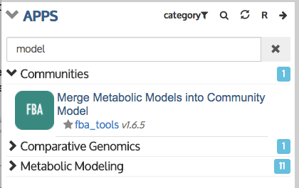
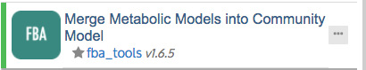
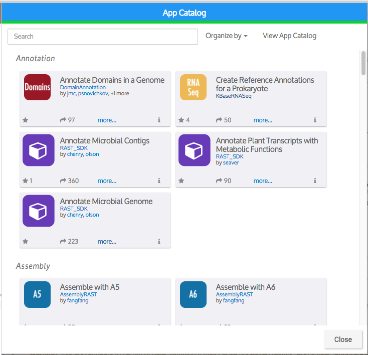
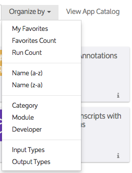
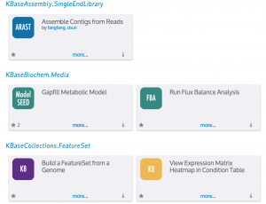
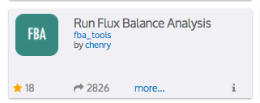
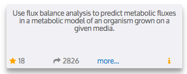

# Browse KBase Analysis Tools

A Narrative can include any number of analysis steps that are added by selecting one or more apps from the Apps Panel directly below your data. Apps are grouped by category. Click the arrow to the left of a category name to see the individual apps in that category.

You can browse KBase Apps by \(1\) scrolling through the list in the Apps Panel; \(2\) searching for an app by name; or \(3\) using the App Catalog \(click the right arrow in the top right corner of the Apps Panel to open it\) to further explore, filter, and designate apps as favorites.

## **Search for Apps in the Apps Panel**

Click the search icon at the top of the panel to begin a text search for apps. Once you enter a term, the list will show only the categories that have apps whose names include the text you typed. As before, click the right-arrow to the left of a category name to see matching apps in that category. \(To see the complete list again, click the "x" to the right of the search box.\)

Clicking the “more…” link opens an app details page featuring an expanded description of the app, along with technical information about its inputs, outputs, parameters, and more. Links to additional documentation such as tutorials or FAQs also may be provided.

## **Access the App Catalog**

All available apps can be found in the App Catalog, which is accessible two ways:

* From [https://narrative.kbase.us/\#appcatalog](https://narrative.kbase.us/#appcatalog) \(no user account or sign-in required for browsing\).
* From the Narrative Interface, by clicking the right arrow at the top of the Apps Panel.

Much like the Data Browser, the App Catalog will slide out, showing the available apps. \(The “View App Catalog” link at the top opens the App Catalog in a separate web browser window.\)

**Add your own app!**

The App Catalog is growing to contain not only the apps generated by KBase staff, but also those created and contributed by outside developers. KBase’s [Software Development Toolkit \(SDK\)](../../developing-apps-1/develop.md), provides a mechanism for users to add their own open-source, open-license tools to the system as new KBase apps.

## **Sort and Filter Apps**

From the App Catalog, you can search for apps by name and use several options to organize and filter how they are displayed \(the default sort is by category\). Click the “Organize by” drop-down menu to see these options.

* **My Favorites** — Lists your favorite apps \(those you’ve clicked the star icon to “favorite”\) at the top of the catalog.
* **Favorites Count and Run Count** — Suggests some of the most popular and frequently used apps in KBase.
* **Name** — Filters apps by name \(alphabetically or reverse alphabetically\).
* **Category** \(default sort\) _\*\*_— Displays apps in groups by analysis type including annotation, assembly, communities, comparative genomics, expression, metabolic modeling, and more.
* **Module** — Sorts apps based on which SDK module they belong to.
* **Developer** — Displays apps alphabetically by developers’ KBase usernames, which are linked to their profile pages. 
* **Input Types and Output Types** —Groups apps based on the type of data that they take as input or generate as output. Each data type is linked to a specification page that provides some technical details, including version, description, structure, and more. This sort can be useful for determining the data you must add to your Narrative before using a specific app. The _**Example**_ tab of the [Data Browser](add-data-to-your-narrative.md) provides access to various data types to help you get started.

## **Explore Individual Apps**

Similar to the App Panel, the App Catalog lets you \(1\) see a short description of each app \(by hovering over the “i”–see second screenshot at right\), \(2\) access the app detail page using the “more” link, and \(3\) add an app to your favorites by clicking the star.

The number beside the star icon indicates how many other users have selected the app as a favorite, while the next number shows how many times the app has been run.

You can access the app module \(a group of related apps\) by clicking its hyperlink \(in this example, “fba\_tools”\). Also, some apps will link to the KBase profile pages of their developers \(in this case, chenry\).

**Feeling adventurous?**

To try out apps still in development, click the little “R” in the Apps Panel, changing it to a “B”. This will show apps that are in Beta \(i.e., still being tested and debugged\). Click the “B” again to go back to “R” \(show only released apps\).

Now that you know how to find an app of interest, the [next section](analyze-data-using-kbase-apps.md) will discuss how to add it to your Narrative so you can begin analyzing data.

