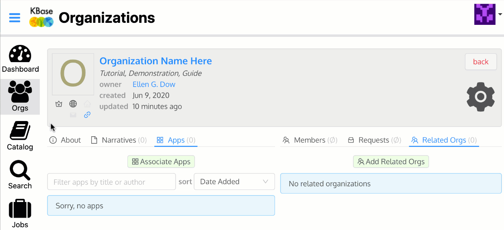

# Creating an Organization

On the Orgs page, click "Create Organization" button on the right side. This will open the Create Your Organization page. Input the information and Save. 

### To create an Organization, you will need: 

* Name ⏤ the displayed Organization Name
* ID ⏤ the unique URL for the Organization; can only contain lower case letters \(a-z\), numeric digits \(0-9\) and the dash "-"
* Logo URL \(optional\) ⏤ include the link to a publicly available image 
* Home Page URL \(optional\) ⏤ input your lab or group's website URL to link and share
* Hidden? ⏤ check for the Organization to be _Hidden - will be visible **only** for members of this organization_ or __leave unchecked to remain _Visible - will be visible to all KBase users_.
* Research Interests ⏤ list your Organization's research interests here
* Description ⏤ provide a description of your Organization

### Editing an Organization

There are options to edit and share an organization after it has been created. 

