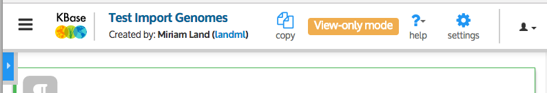
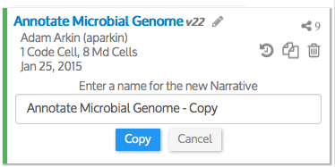
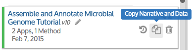

# Access and Copy Narratives

## View Narratives created by or shared with you

The Narratives tab has two sections that list Narratives that you have created \(_My Narratives_\) and, below that list, those that have been shared with you by other users. The _Shared With Me_ list includes only those Narratives that were explicitly shared with you, not those that are viewable by everyone \(public Narratives\). The public Narratives can be accessed from the Narratives dash.

If you click on one of the Narratives in your Narratives panel, it will open in a new web browser window. If it’s a Narrative that you own, you will be able to run it or edit it. However, if it’s one that someone else owns and shared with you without write permission, you won’t be able to edit or run it–it will open in _View-only mode_.

**View-only mode**

The key difference you will notice when a Narrative opens in View-only mode is that there is no Analyze panel on the left side–you won’t see any data objects or apps. This is because you can’t modify or run a Narrative that was shared with you with only View permission.

Why can’t you run a Narrative owned by someone else? Because, as we’ve seen, running an app usually creates new data objects in your Narrative, which requires write permission. If you want to run a Narrative owned by someone else who has not given you write permission, you will need to copy it to your account.

The blue box with a small white arrow on the top left of a View-only Narrative opens the Data Panel \(so you can see the data objects in this Narrative\) and the Narratives list \(so that you can go to another Narrative\).

TIP: You can switch a Narrative that you own to view-only mode by clicking the pencil icon under the title of the Narrative.

If you ever want to print out a Narrative, switch it to view-only mode first, so it doesn’t waste the left side of the page with empty space.

## Copy a Narrative

To copy a Narrative that has been shared with you, so that you can run or change it, you can use the blue “Copy This Narrative” button at the top of the Narratives panel \(or, in View-only mode, at the top right of the screen\). This will copy the Narrative that you are currently viewing \(which is marked with a green dot in the list of Narratives\). You can choose a name for the copy \(or leave the default name, which is the original name with “Copy” at the end\).

When you click Copy, the Narrative and its associated data objects are copied to your account, and you should see the new copy appear at the top of “My Narratives”.

**Copy of a copy warning**

Please be aware that if you copy a copy of a Narrative, some things may not work right in the copy of a copy. We are working on resolving this problem.

You can copy any Narrative by hovering your cursor over its name in your Narratives panel to reveal the icons and clicking the Copy icon \(the one that looks like two sheets of paper\).

The copy is now yours–you can open it, run it, edit it, or even share it with others \(if the owner of the original Narrative gave you sharing privileges\). After you’ve copied a Narrative, you can run all the steps to reproduce the computational experiment, or try changing the parameters or input data to alter or perhaps even improve the results.

Copying Narratives is the key to leveraging KBase’s commitment to reproducibility and reusability. By making it easy to build on previous work and go through rapid cycles of analysis, KBase aims to accelerate the pace of systems biology research.

