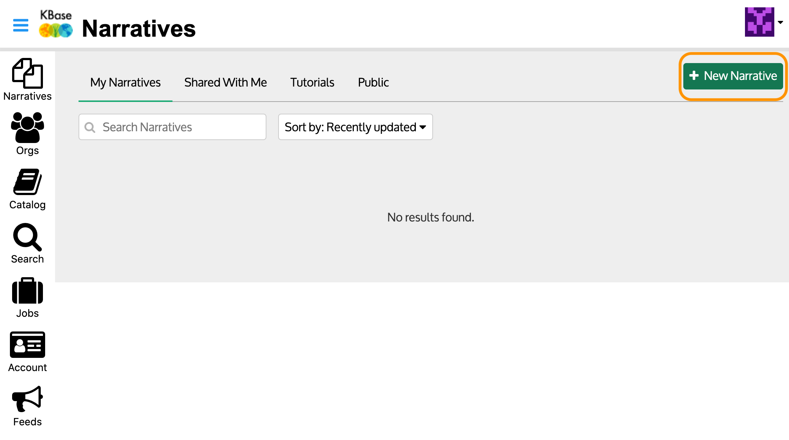

# Create a Narrative

You can create a new Narrative from your [Narratives](narratives.md) by clicking the “+ New Narrative” button, which will take you to a new Narrative Interface. 

If you are already in the Narrative Interface, you can start a new Narrative by selecting the _Narratives_ tab \(next to _Analyze_\) and clicking the button labeled “+ New Narrative.”

Your Narrative will open in a new browser tab and contain a default “Welcome to the Narrative” cell that provides brief instructions for using the Narrative Interface. You can retain this cell or delete it with the “Delete cell” option in the “…” dropdown menu in the upper right corner of the cell.

You can name the Narrative now by clicking on “Untitled” and entering a new name.

Note: The new Narrative will not appear in your Narratives list until it is named something other than ‘Untitled’ and you have clicked the Save button to save it.

We hope that after working on your Narrative, you will want to [share it](share.md) with other users. **Any Narrative you create is private until you choose to share it**.

In the sections that follow, we will explain how to [explore data](explore-data.md), [add data to your Narrative](add-data.md), and use [apps](add-apps.md) to analyze it.

## Copy and run Narratives created by others

If you don’t feel quite ready to create your own Narrative, you can copy and run a Narrative that someone else has shared with you. Please see the [Access and Copy Narratives](access-and-copy.md) section for more information.

