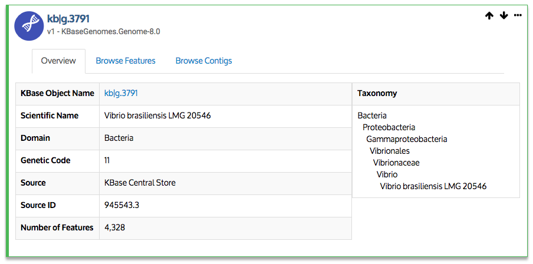

# Explore Data

There are several ways to find data and add it to your Narrative. You can select data available within KBase, [upload your own files, or import datasets from external resources](add-data.md) such as the DOE Joint Genome Institute \(JGI\) or NCBI. This section will describe how to explore data already in KBase. Instructions for adding data to your Narrative and importing external files are provided in the next section “[Add Data to Your Narrative](add-data.md).”

## The Data Browser

There are several ways to explore the [wide range of data available in KBase](../../data/).

The Data Browser slide-out is accessed by clicking the right-facing arrow in the menu or the red rectangular "Add Data" button in the Data Panel.

  
The Data Browser will slide out, with tabs that show several data sources that will be discussed in more detail later:

* **My Data** — data you have already loaded or analyzed in another Narrative
* **Shared With Me** — data included in Narratives that have been shared with you
* **Public** — data in KBase that is accessible to everyone
* **Example** — example datasets that can be used as inputs to apps and methods
* **Import** — mechanism allowing you to import your own data \(of supported types\) to your Narrative

Find a public reference genome available under the _Public_ tab to examine information and metadata about that genome.

Clicking the _Public_ tab displays a list of data objects available in the KBase reference collection.

  
The data-type selector at the top left of the browser window defaults to NCBI RefSeq Genomes. You can change which type of data is displayed under the _Public_ tab by using this pulldown menu.

You can also use the “_Search/Filter data..."_ field in the Data Browser to find data objects whose names include the text you’ve typed in the search box. \(Note — searches are not case-sensitive\). Enter “Vibrio brasiliensis” in the search field.

If you hover over a data object in the Data Browser panel, three small images appear: an _"&lt; Add " button_ in a blue rectangle to the left of the object name and _binoculars_ icon and a _graph-like_ icon to the right. These latter two icons open a **Data Landing** page and a **Provenance** page, respectively.

Go ahead and click the "&lt; Add" button to add the _Vibrio brasiliensis_ LMG 20546 genome to your Narrative. Notice that this genome now appears in your Data Panel.

## Information in the Data Panel

The Data Panel shows all the data that you’ve added to your Narrative. \(The [next ](add-data.md)[section](add-data.md) of this guide discusses in more detail how to add data to your Narrative.\)

You should have at least one object \(_Vibrio brasiliensis_ LMG 20546\) in your Data Panel. As you add or generate more data during the course of your analyses, the number of objects in this panel will increase. You can search, sort, or filter the list using the icons in the Data Panel header.

You can access more details about a particular data object by hovering over the object and clicking the ”...” that appears in the right-hand side of the data object.

The expanded view of the data object reveals icons that let you examine or manage the data.

* The **arrow in** icon for **"Show Apps with this as input"** shows the apps \(in the App Panel\) that can use this type of data for input.
* The **arrow out** icon for the **"Show Apps with this as output"** button that shows the apps \(in the App Panel\) that will generate this type of data as a data object. 
* The **binoculars** icon is the **"Explore data"** button that open a Data Landing page for the data object.
* The **page with three lines and folded upper right corner** icon is the **"View associated report"** button and will open the Data View report page for the data object. 
* The **counter clockwise circle with clock hands** is the **"View history to revert changes"** icon allows you to see and revert to previous versions of the data.
* The **graph-like** icon is the **"View data provenance and relationships"** button that opens the Provenance page \(described below\).
* The **download** icon is the **"Export/Download data"** button that lets you download a data object to your local computer. \(Note — This capability is still in development; most data objects currently can be downloaded only in the JSON format. In the future, you will be able to choose from a variety of common formats such as GenBank.\)
* The **“A”** icon is the **"Rename data"** button that lets you rename your data object. Use with caution. If a Narrative was already using the old object name in analyses, they might stop working. Object names can contain only letters, digits, and underscores; no spaces or other special characters are allowed.
* The **trash can** icon is the **"Delete data"** button that lets you delete a data object from your Narrative. \(If the data came from a public or shared data source, only the copy within your Narrative will be deleted.\)

## Data viewers

Many types of data in KBase have viewers that allow you to learn more about the data. These viewers can be accessed two ways from the Data Panel:

1. Click the name of a data object, and its viewer will be added to your Narrative.
2. Drag the object from the Data Panel and drop it into the main part of your Narrative.

Below is the genome viewer for the _Vibrio brasiliensis_ LMG 20546 genome that is in the Data Panel.

Notice that this genome viewer has tabs for an overview \(including GC content, taxonomy information, size, and more\) and a list of contigs and genes. Each contig and gene entry in these lists is clickable, opening either a contig browser or a tab with expanded information about the gene.

**Sorting table entries in the viewer**

You can sort the table entries by clicking on a column header to sort by that field \(e.g., Length\). Clicking the same column header again will reverse the sort order. For example, the screenshots below show the table sorted in descending order by _Contig name_ and then in descending order by _Length._

You can also sort by more than one column at a time by clicking one column header and then Shift-clicking other column headers. For example, here we have sorted in ascending order by contig length, and then \(by shift-clicking the Genes column header\) in ascending or descending order by number of genes. Notice how the two rows with length=253 \(the bottom two, in these screenshots\) have switched places.

There are many types of viewers in KBase in addition to the Genome viewer discussed here. Different viewers may have different options to explore.

To remove a viewer from your Narrative, click the trashcan icon in the top right of the viewer cell. You can always re-add the viewer; removing it from your Narrative doesn’t delete the data object itself.

## Data Landing and Provenance pages

Data Landing \(also known as _Data Summary_\) and Provenance pages are ways to find out even more information about a data object. You can access these pages using the icons that appear when you hover over a data object in the Data Browser or click on one of the objects in your Data Panel. The binoculars icon opens a new Data Landing page about that particular data object, while the graph-like icon opens a Provenance page.

**Data Landing pages** \(which are still in development\) provide both known and contextual information about a data object, allowing users to examine various particulars about the data and, eventually, compare it to other data objects. Depending on the type of data and where it came from, different sorts of information might be presented. For example, for a genome already in KBase \(such as the one we loaded earlier, [Vibrio brasiliensis LMG 20546](https://narrative.kbase.us#dataview/KBasePublicGenomesV4/kb%7Cg.3791)\), you will see:

* A data object summary
* A data provenance and reference network \(collapsed by default; open it by clicking the &gt; on the left\)
* A genome overview panel that lists information about the genome, including its biological domain, DNA length, etc.
* A description of the species \(including photo, if available\)
* Publications that mention this genome
* The taxonomic lineage
* A species tree \(with the option to create a tree if one doesn’t yet exist for this species\)
* A contig browser
* Functional categories
* and more

**Provenance pages** are one way to facilitate reproducibility and transparency of scientific results, two key principles of KBase design. All data in KBase is versioned, and older versions of a data object can be accessed from the Provenance page. This page records and illustrates how data is derived and modified in KBase, including how it entered the system, whether it was produced through analysis of other objects, who generated the data, and when. You also can identify the original “owners” of the data, allowing you to contact them or see their shared analyses.

The image below shows the Provenance page for a flux balance analysis model that was generated in KBase.

In the [next section](add-data.md) of this guide, we will discuss in more detail how to add data to your Narrative.

