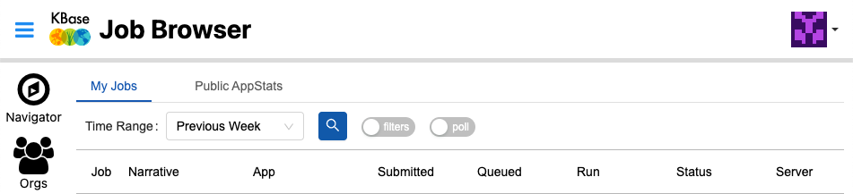
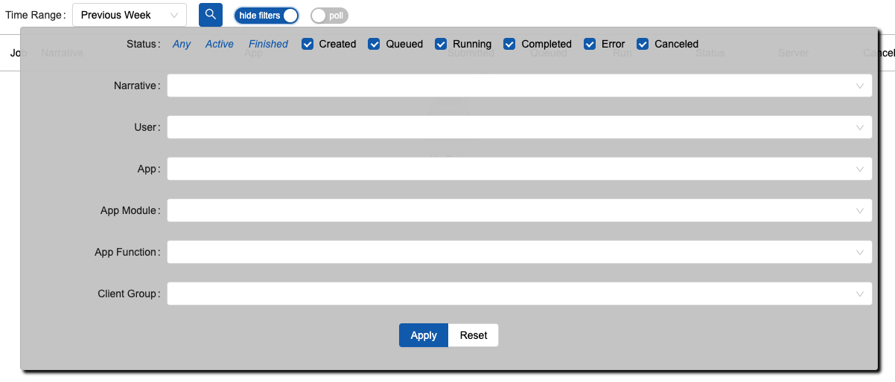

# Job Browser

The Job Browser is one of the buttons on the left sidebar menu in KBase. In addition to viewing job status within a Narrative, the Job Browser allows you to monitor and manage your jobs across Narratives. By default, it shows all jobs submitted within the Previous Week. You can change the timeframe to the Previous hour, 48 hours, month, year, All Time, or a custom range of dates using the Time Range drop down menu.

<figure><figcaption></figcaption></figure>

Filter jobs through toggling filters. The pop-up will  allow you to filter the jobs by _Created_, _Queued_, _Running_, _Completed_, _Error,_ and _Canceled._ You can check as many filters you want and apply other terms. Applying these filters will update the page. Otherwise, the table does not auto-refresh.

<figure><figcaption></figcaption></figure>

The results display basic information for the jobs such as the Narrative they are located, App, date Submitted, time Queued, Run time, current job Status, Server, and if the job was Canceled. The name of the Narrative is linked, and clicking on it will open the Narrative in a new tab. The App ID is linked and clicking on it will open a new tab with the App Catalog page.

### Job Status

The overall Job status is stated in the Status column. To inspect the Job Log, click the  icon to open the table and show the contents of the log. Click the 'x' or 'Close' buttons to close the table. Canceling the job will prompt you to make sure you didn’t click it accidentally. Jobs that have been canceled may continue to show up as “Queued” or “Running” until they clear the system.

### Job Log

The Job ID and worker node are easily located and the log can be scrolled through within the pop-out. Job Logs can be downloaded in CSV, TSV, JSON, and TEXT formats using the download (downward-facing arrow into tray) icon.&#x20;

