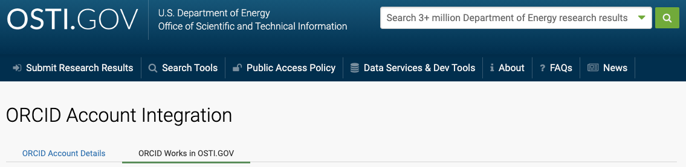

# Linking DOIs to Static Narratives

Adapted from the article [DOE OSTI Search & Link Wizard Added to ORCID by  Stephanie Gerics and Carly Robinson](https://info.orcid.org/doe-osti-search-link-wizard/)

## Add Works using the DOE / OSTI Search & Link Wizard

1. Sign in to ORCID
2. Scroll down to the Works section of your ORCID record and hover over the '+Add works' in the menu and select 'Search & link'

3. Under 'Link Works', select DOE / OSTI from the list of member organizations. 

4. While using the DOE / OSTI Search & link wizard for the first time, you will need to Authorize access to approve DOE / OSTI to make changes to your ORCID Works. 

Once DOE / OSTI is authorized, the OSTI.GOV page will appear with the green ORCID iD icon next to the user’s ORCID iD name, as shown below. The ORCID Account Integration page will display _Authorization successful!_, the user’s _ORCID Account Details,_ _ORCID Works in OSTI.GOV,_ and directions for adding works to the user’s ORCID record using OSTI.GOV’s search. Browse DOE / OSTI search results to identify records authored, coauthored, or contributed by the user

5. Once you find records in the search results to add to your ORCID record, select 'Add to ORCID Works.'

6. A pop-up text box will appear and confirm that the user wants to add this record to ORCID Works. Select 'Add to my ORCID Works_'_. 

7. In the search results, works added by the user to their ORCID record will now display 'In your ORCID Works' at the bottom right of the popup.

8. To view your list of works added to your ORCID record, navigate back to the 'ORCID Account Integration' page. Select the user name next to the green ORCID iD icon at the top of the page. 

9. Click on the ORCID Works in OSTI.GOV to see the works integrated with your account. 

