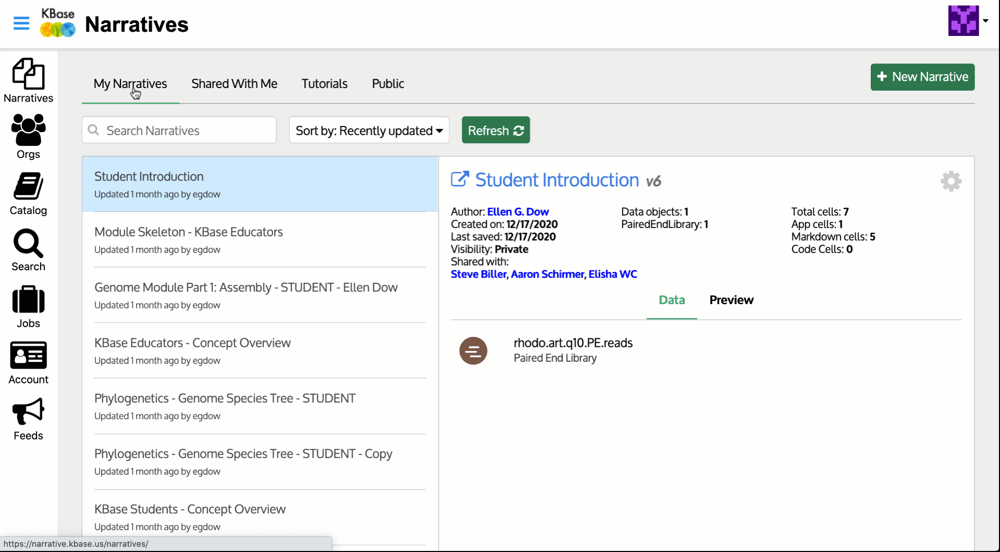
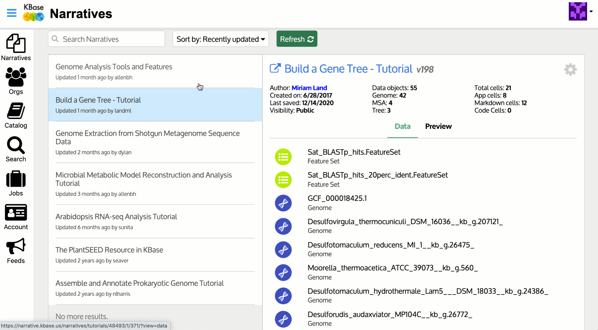
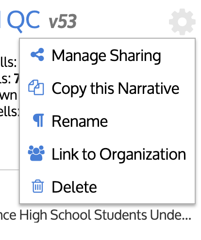
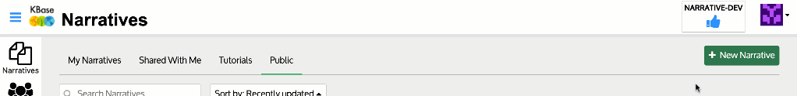
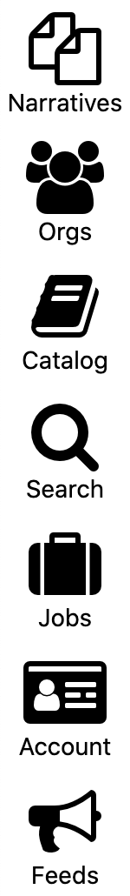
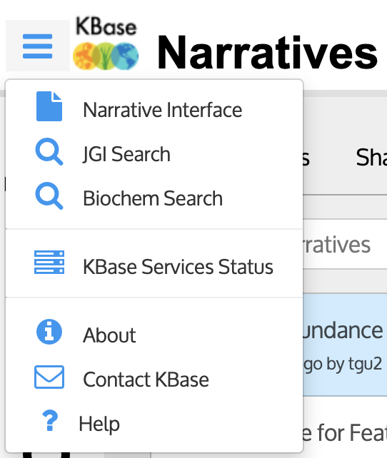

# Narratives - the updated Dashboard

Welcome to Narratives! You may notice there are a few changes when you sign in to narrative.kbase.us. Let's get you up to speed with a tour. 



## Updated Tabs

**Narratives \('Your Dashboard'\)**

* There are five tabs for exploring and locating existing Narratives: **My Narratives, Shared with Me, Tutorials,** and **Public.**
* The most recently updated Narratives appear first, but can be searched or sorted using the dropdown menu - _Recently updated, Least recently updated, Recently created, Oldest, Lexographic \(A-Z\), Reverse Lexicographic \(Z-A\)_.
* A list of available Narratives will be on the left panel and information on the selected Narrative on the right panel. Here you can see an overview of the Data within the Narrative and a Preview.  
  * Icons under a Narrative name indicate which apps the Narrative includes, how many markdown and code cells it contains, the number of times the Narrative has been shared, whether there are any running jobs, total running time for all completed jobs, and more.
* Click on the selected Narrative name to open it.

* Click on the _Gear_ icon next to the Narrative title for management options to: 
  * Manage Sharing
  * Copy this Narrative
  * Rename
  * Link to Organization
  * Delete

* You can use the _Search Box_ at the top of each panel to find a particular Narrative within that category.
* Click the green _+ New Narrative_ button at the top to create a new Narrative.

* Note that **Public Narratives** have not necessarily been reviewed or tested by the KBase team; they are simply Narratives that have been made public by their owners.

## Where can I go from here?

The Dashboard offers many launch points. To the left of the **Your Narratives** panel you will see seven icons allowing you to toggle between the **Narratives**, **Orgs**, **Catalog**, **Search**, **Jobs**, **Account,** and **Feed** tabs.

**Narratives**

* Takes you to your accessible **Narratives**, the features of which are described above.

**Orgs**

* Takes you to a list of the **Organizations** within KBase, along with descriptions and statistics for the Organizations, including Narratives and Apps. 
* The default shows "My Orgs," the Organizations you belong to as a member. 
* You can view and search all Organizations by selecting the toggle button on the right hand side of the page for "All Orgs." 
* Under "All Orgs" you can search and select different Organizations and request to join by clicking on the "Join this Organization" button. 

**Catalog**

* You can use the **App Catalog** to browse, search for, and see the specifications of each app KBase has to offer.

**Search**

* The **Data Search** tab gives you the ability to search JGI data \(Beta\) as well as KBase user and reference data.
* It allows you to search for data present in your own Narratives, those shared with you, and those made public by their owners.
* It also enables you to search for reads and assemblies contained in the Joint Genome Institute \(JGI\) Genomes Online Database \(GOLD\) and add them directly to your Narratives.

**Jobs**

* The **Job Browser** allows you to view apps that you have run recently, see their progress, search for specific runs, and more.
* You can filter the runs by _Finished_, _Queued_, _Running_, _Success_, and _Error_
* Query results also display basic information surround the runs such as the Narrative they can be found in, App ID, Submission Time, Queue Time, Run Time, and Status

**Account**

* In the **Account Manager** you have access to edit your profile information.
* From this tab you can also get to your **Profile Page** which gives an overview of your Narratives and your Collaborators.
* You can access the user profile of any of your Collaborators by simply clicking on the name under the **Your Collaborators** panel while in your **Profile Page.**

**Feeds**

* Takes you to the **Notification Feeds** page to view notifications from KBase. 

## Top-Level Menu

The top-level menu \(accessed by clicking the three small horizontal lines on the upper left of the window\) offers additional possibilities:

_Narrative Interface_ goes to the main Narrative Interface, which allows you to create, edit, run, and share Narratives.

_JGI Search_ goes to the [Data Search](https://narrative.kbase.us/#jgi-search?q=) tab that can also be reached by the Search icon in the side bar.

_Biochem Search_ goes to the Compound and Reaction search tabs. 

_About_ goes to [a page that describes the KBase system](https://kbase.us/what-is-kbase/).

_KBase Services Status_ goes to [a page that describes the current version of the Narrative Interface](https://narrative.kbase.us/#about/services).

_Contact KBase_ lets you [contact the KBase Help Desk](https://kbase.us/contact-us/) with your question, bug report, or feature suggestion.

_Help \("?"_ \) brings you to the [Narrative User Guide](https://kbase.us/narrative-guide/).

In the next section, we’ll discuss [how to create a new Narrative](create.md).

