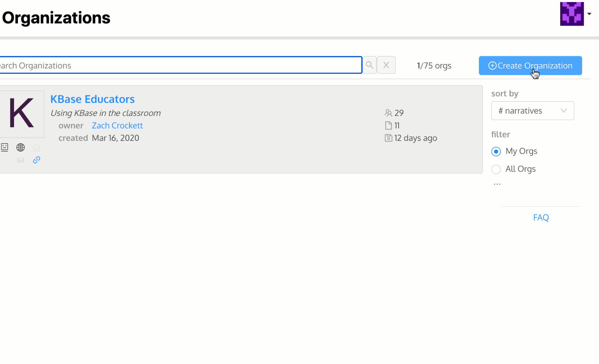

# Organizations

## What is a KBase Org?&#x20;

In science, people are members of labs, teams, groups, collaborations, and projects that work together with shared data and analyses. In KBase, organizations are a way for teams of scientists to share their data and associated analyses that are in the Narratives they create with each other as a group. Organization members can see information about the team and a list of the Narratives associated with the organization to which can request access. View-only access is granted upon request while all other access to the Narrative is granted by the Narrative owner. KBase users can be members of more than one organization and Narratives with the associated data might also be added to more than one organization.&#x20;


7 minute video tutorial on KBase Organizations


## Creating an Organization

On the Orgs page, click "Create Organization" button on the right side. This will open the Create Your Organization page. Input the information and Save.&#x20;

### To create an Organization, you will need:&#x20;

* Name ⏤ the displayed Organization Name
* ID ⏤ the unique URL for the Organization; can only contain lower case letters (a-z), numeric digits (0-9) and the dash "-"
* Logo URL (optional) ⏤ include the link to a publicly available image&#x20;
* Home Page URL (optional) ⏤ input your lab or group's website URL to link and share
* Hidden? ⏤ check for the Organization to be _Hidden - will be visible **only** for members of this organization_ or __ leave unchecked to remain _Visible - will be visible to all KBase users_.
* Research Interests ⏤ list your Organization's research interests here
* Description ⏤ provide a description of your Organization

### Editing an Organization

There are options to edit and share an organization after it has been created.&#x20;

## Joining an Organization

* If an invitation appears in your feeds, click on the ID of the organization. A window will pop up with options to Accept or Reject the invitation. Click on your preference.
* Without invitation, search for the organization and click on its name. Click on the blue button (upper right) to ‘Join Organization’. You cancel this request if needed. A request to join will be sent to the owner and group administrators. An acceptance or rejection will be added to your Feeds. Note: Private organizations will not appear.&#x20;
* If you know the organization URL (starts with https://Narrative.kbase.us/#org/) go to the webpage and request membership.

## Viewing Narratives in an Org

* If you haven't opened the Narrative before, there will be a "Click for Access/View Access" button
* Click the button, now you can view the Narrative&#x20;
* To open the Narrative, click on the Narrative name
* There are several icons that may appear in the Narrative cell:
  * **globe**  - Narrative is shared publicly with all KBase users
  * **pencil**  - Narrative is shared with you with _edit access_
  * **open lock**  - Narrative is shared with you with _access_ to edit and share
  * **closed lock**  - private
  * **eye**  - View-Only access
  * **crown**  - you are the owner

## Administering an Organization

* Add Narratives by either the "+ Add a Narrative" button or [share Narratives](share.md#users-tab) with an Org.&#x20;
*   Invite members by clicking the invite button on the right above the list of members.

    In the Search box ‘Select User to Invite’, type in the user’s name or KBase ID. A list of users will appear below the search box. Click on the user to invite and the name will appear on the right with more information that can be used to confirm it is the correct user. If correct, click on the blue ‘Send Invitation’ button.&#x20;
* On the right side of the organization page is a list of organization members. Above the list of members is a tab called ‘Requests’. There is an "Inbox" for a list of Users requesting to join and an "Outbox" of owner/administrator invitations for pending invitations for users to join that the owner or administrator made. Requests can be accepted or rejected by clicking the respective buttons. Invitations can be cancelled at any time, but will also disappear after a length of time.&#x20;
* Owners and administrators can can promote members to administrator. In the membership list, click on the ‘...’ to the right of the member’s name and click on ‘Promote to Admin’.
* Members can be removed by click on the ‘...’ to the right of the member’s name in the membership list and click on ‘Remove Member’. The user is not notified that they have been removed.
* &#x20;There is no mechanism to delete an organization. You can un-associate all Narratives, remove all members and set the group to “Private.” \
  \

