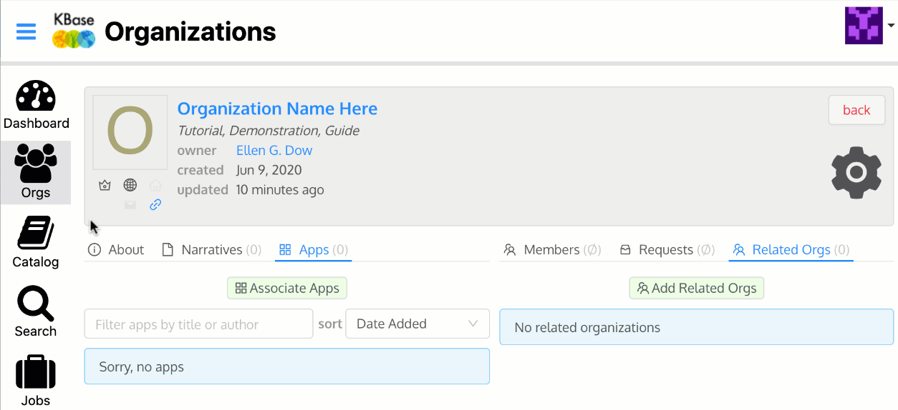

# Organizations

## What is a KBase Org? 

In science, people are members of labs, teams, groups, collaborations, and projects that work together with shared data and analyses. In KBase, organizations are a way for teams of scientists to share their data and associated analyses that are in the Narratives they create with each other as a group. Organization members can see information about the team and a list of the Narratives associated with the organization to which can request access. View-only access is granted upon request while all other access to the Narrative is granted by the Narrative owner. KBase users can be members of more than one organization and Narratives with the associated data might also be added to more than one organization. 

## Creating an Organization

On the Orgs page, click "Create Organization" button on the right side. This will open the Create Your Organization page. Input the information and Save. 

### To create an Organization, you will need: 

* Name ⏤ the displayed Organization Name
* ID ⏤ the unique URL for the Organization; can only contain lower case letters \(a-z\), numeric digits \(0-9\) and the dash "-"
* Logo URL \(optional\) ⏤ include the link to a publicly available image 
* Home Page URL \(optional\) ⏤ input your lab or group's website URL to link and share
* Hidden? ⏤ check for the Organization to be _Hidden - will be visible **only** for members of this organization_ or __leave unchecked to remain _Visible - will be visible to all KBase users_.
* Research Interests ⏤ list your Organization's research interests here
* Description ⏤ provide a description of your Organization

### Editing an Organization

There are options to edit and share an organization after it has been created. 

## Joining an Organization

* If an invitation appears in your feeds, click on the ID of the organization. A window will pop up with options to Accept or Reject the invitation. Click on your preference.
* Without invitation, search for the organization and click on its name. Click on the blue button \(upper right\) to ‘Join Organization’. You cancel this request if needed. A request to join will be sent to the owner and group administrators. An acceptance or rejection will be added to your Feeds. Note: Private organizations will not appear. 
* If you know the organization URL \(starts with https://Narrative.kbase.us/\#org/\) go to the webpage and request membership.

