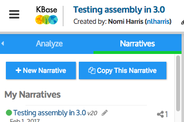
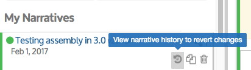
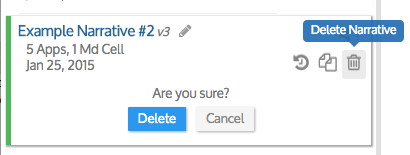

# Revise Your Narrative

You can browse a list of your Narratives in the _Narratives_ tab:

Your Narratives are shown in the _Narratives_ tab in reverse chronological order, with the most recently updated Narrative first. After your personal Narratives, more Narratives owned by others and shared with you are listed.

## View Narrative history and revert to earlier versions

KBase stores a history of everything you’ve done to your Narrative, so you are able to revert changes and go back to an earlier version. When you hover your cursor over one of your Narratives in the Narratives panel, three icons will appear.

The first of these icons (counterclockwise encircling arrow) lets you View Narrative history to revert changes or access prior saved versions of the Narrative. Here you can choose an earlier version of a Narrative to revert to from the saved versions.&#x20;

## Add text to your Narrative

Adding text cells to your Narrative to explain what you were doing and what the results might mean will help others understand your computational experiments, as well as helping to remind you what you were doing. You can add formatted text to your Narrative in “Markdown Cells”. Markdown is a markup language (one example is HTML). It’s pretty easy to learn but does require knowing some syntax. A good [Markdown CheatSheet](https://github.com/adam-p/markdown-here/wiki/Markdown-Cheatsheet) can be found on GitHub.

You can add Markdown cells to a Narrative using the translucent blue buttons at the bottom right of the main Narrative panel.

The button on the right is the “Add Markdown Cell” button and will add a Markdown cell under the currently selected Narrative cell.

New Markdown cells contain the placeholder text “\[Empty Markdown / LaTeX cell]” (LaTeX is a formatting language). To edit a Markdown cell, double-click it to enter edit mode. When you’re done, press Shift-Return to exit the cell.

The ">\_" button will Add a Code Cell, which is beyond the scope of this user guide. TIP: To use a code cell press Shift-Return within the cell to execute the code.

## Cell commands: move, delete, etc.

Via the arrows and menu items in a Narrative cell, you can move the cell up or down, collapse or expand it, show the code that runs the analysis, get more info about the app, or delete the app cell. The cell menu can be opened by clicking the “…” icon in the upper right corner of a cell.\

.gif>)

## Rename or delete a Narrative

To rename a Narrative, click on its name at the top of the Narrative window. A window will pop up to let you change the name.

If you decide to delete a Narrative that you own, click the trashcan icon. Delete with caution, because currently there is no way to get your deleted Narrative back.

## **Save your work!**

Although your Narrative is periodically autosaved, it is always a good idea to save your work frequently, using the Save button at the top right of the screen.

.gif>)

Once you are happy with your Narrative, you will probably want to share it with others. The section [Share Narratives](share.md) describes how to do that.
