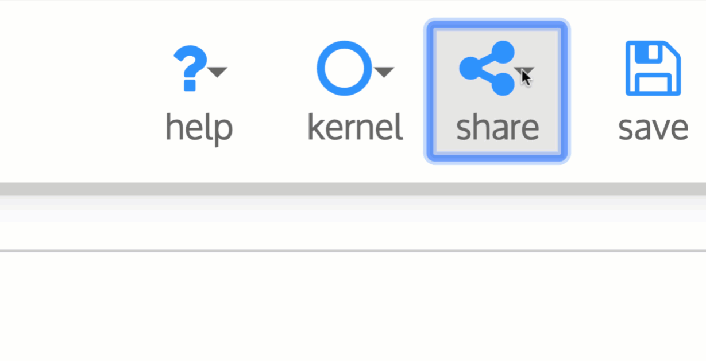
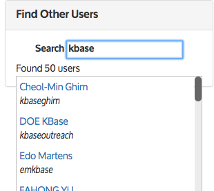

# Share Narratives

Narratives are _collaborative_ \(multiple people on your project can work on a Narrative together\), _shareable_ \(you can share your Narrative with specific people or with everyone\), _publishable_ \(a finished Narrative is similar to a research paper, and can be cited as a URL\), and _reproducible_ \(you can repeat or even change another scientist’s computational experiment if they publish it as a Narrative\). We believe that you will ultimately help both yourself and other researchers by sharing your Narratives so that others can see what you were thinking, what you did, and what you concluded from your analyses. However, **all of your Narratives are** _**private \(viewable only to you\)**_ **until you decide to share them.**



### How to Share a Narrative

You can share a Narrative that you own with any set of people you choose, or with all KBase Users. To share a Narrative, click the “share” button near the top right and select the "Manage Sharing" option in the menu. 

You will now see the Change Share Settings popup window. Here, you can see the people you have already shared with \(right now, only you\).

If you want to share your Narrative with everyone, you can click the “make public” link near the top of the sharing panel. 

### Users tab

If you only want to share it with a few people, you can type their name or username into the “share with” box. Once you have typed something that matches a name in the KBase User Database, the person’s full name will appear. Click the down arrow to the right of the “share with” box to assign permissions to that user–you can allow them only to view your Narrative, to edit it, or to edit and share it.

For example, suppose you want to share your Narrative with kbasehelp so that KBase staff can help you troubleshoot it. You can start typing any part of the username or real name and a list of users that match will appear:

The default permission level for sharing is “View only”, which lets the user you’re sharing with see the Narrative but not let them edit it or share it with others. If you want to share your Narrative with a collaborator and give them more privileges, click the down-arrow to see the permission levels and possibly choose a different one.

You can add multiple users to share with:

Click the “Apply” button to add the chosen user\(s\) to the sharing list for your Narrative. The usernames and permission levels for the users you shared with will appear at the bottom of the Share panel.

### Orgs tab

To share your Narrative with a specific Organization, select the Orgs tab. Here you can add a single or multiple Organizations to share with a group of users. 

Click the “Apply” button to add the chosen Organization\(s\) to the sharing list for your Narrative. The Organizations and permission levels for the users you shared with will appear at the bottom of the Share panel.

When you’re done sharing, click the "x" icon to close the Share panel.

### Editing access permissions

You can change the access permissions at any time by clicking the Share button again. The up/down arrows next to each user’s permissions let you change the permissions.

Note: Unless you alert another user that you have shared a Narrative with them, they will not notice a newly shared Narrative until they see your shared Narrative in their “Narratives that have been shared with you” tab or click on your name in her collaborator list.

If you are working on a shared Narrative, and a collaborator is working on it at the same time, watch for a red box at the top of the screen that says “Narrative updated in another session.” You can update to the latest version by refreshing the page, but note that any changes that you made to the Narrative will be lost, and if you try to save your changes, you might overwrite your collaborator’s changes.

## Create or modify your user profile

Every KBase User has a user profile. Filling in your KBase user profile helps you become part of the social web that KBase is building, making it easier to find and collaborate with other scientists and share data and Narratives. You are not required to complete your user profile in order to use KBase, but we encourage everyone to do so.

To see and edit your user profile, go to your Dashboard and click the “Account” button on the left side. Your profile page will open, looking something like the screenshot below. You will be able to enter or change information including your organization, department, job title, research interests, avatar, and more. Required fields are marked with a red "\*." You must fill in all required fields in order to save your profile \(using the Save button on the upper right of the page\).

Below the "Save" button is a small preview showing what your profile page looks like to others. You can click the “Open Your Profile Page” link to see a bigger version, along with a list of your Narratives and collaborators \(other users with whom you have shared Narratives, or who have shared Narratives with you\) and a search box for searching for other users by name or username. As you start typing in the box, you will see a list of users who have that text in their first or last name or their username. Click one of the matches to see that user’s profile.

The **Account** tab lets you see basic information about your KBase account. The only field that can be edited there is your preferred email address. Note that other users cannot see your email address; it will be used only by KBase staff to contact you occasionally with important information.

The **Linked Sign-In Accounts** tab lets you see and [manage](../sign-up/linking-orcid.md) which external \(Globus or Google or ORCiD\) accounts are linked to your KBase account.

The **User Profile** editor allows you to edit your position, organization, and location. You can also input your Research Interests, Research or Personal Statement. It also shows which KBase _Organizations_ you belong to and any Affiliations. 

