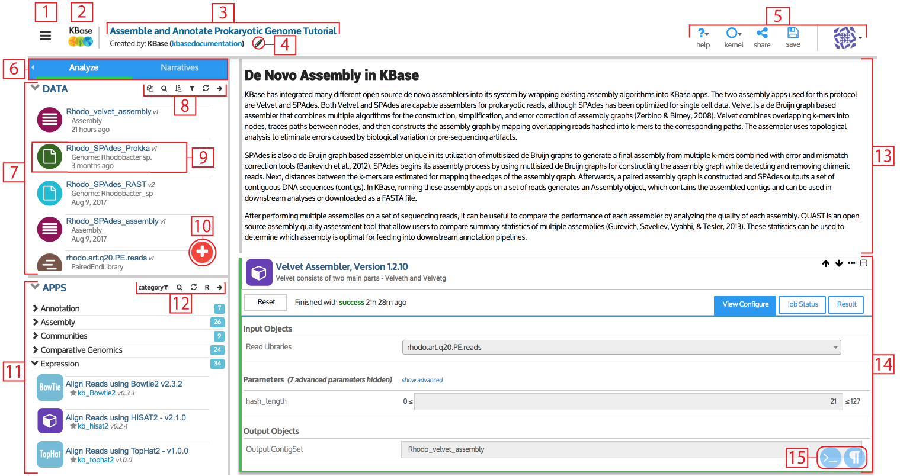
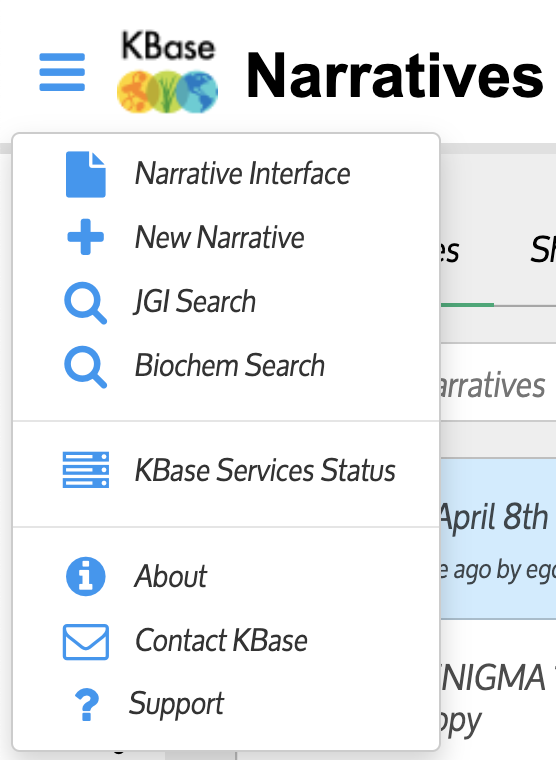

# Tour the Narrative Interface

When you open a new Narrative, a “Welcome” cell will appear at the top, offering quick tips for getting started and links for accessing help. You can keep the Welcome cell, collapse it by clicking the "-" button in the top right corner of the cell or delete it by selecting "Delete cell" from the "..." dropdown menu.

## The Welcome Cell

When you first create a Narrative, you may notice the Markdown cell that says "Welcome to the Narrative". This is a quick link to this documentation site and shares information on any service status for kbase.us.&#x20;

Before adding data and analysis steps to your Narrative, take some time to explore a few high-level features of the Narrative Interface.

## Managing Narratives and accessing resources

### **1. Top menu**

* _Narratives Navigator_ lets you access other [Narratives](narratives.md) from a Narrative.
* _About the Narrative_ opens a window describing Narrative Interface properties (including version number) and provides a link to notes about the latest KBase release.
* _Shutdown and Restart_ closes and relaunches the Narrative Interface (which can be useful if your content fails to load or the Narrative appears frozen).

The top-level menu (accessed by clicking the three small horizontal lines on the upper left of the window) offers additional possibilities:

* _Narrative Interface_ goes to the main Narrative Interface, which allows you to create, edit, run, and share Narratives.
* _New Narrative_ opens a new Narrative in a new window. &#x20;
* _JGI Search_ goes to the [Data Search](https://narrative.kbase.us/#jgi-search?q=) tab that can also be reached by the Search icon in the side bar.
* _Biochem Search_ goes to the Compound and Reaction search tabs.&#x20;
* _About_ opens a page that describes the [KBase User Interface](https://narrative.kbase.us/#about) and connects to the [KBase GitHub](https://github.com/kbase).
* _KBase Services Status_ goes to [a page that describes the current version of the Narrative Interface](https://narrative.kbase.us/#about/services).
* _Contact KBase_ lets you [contact the KBase Help Desk](https://www.kbase.us/support/) with your question, bug report, or feature suggestion.
* _Support ("?"_ ) brings you to the [Narrative User Guide](./).

#### In the tabs below Narratives, the top-level menu will look like this:&#x20;

* _KBase Services Status_ directs to information on service versions and performance.&#x20;
* _KBase UI Plugins_ lists user interface plugins and their version info and links to GitHub.&#x20;
* _Developer_ links to developer tools and the configuration editor.&#x20;
* _Public Search_ can be used to locate data and filter by data types.&#x20;
* _About_ directs to information about the KBase User Interface and current version. &#x20;
* _KBase (home)_ will open a new window to [kbase.us](https://www.kbase.us).
* _Docs_ will open a new window to the KBase Documentation site at [docs.kbase.us](https://app.gitbook.com/o/-LrErV7S3Qxyj1T85yxI/s/-LrEs-tqcRLeDlhbWQs-/).&#x20;
* _Support_ will open [www.kbase.us/support](https://www.kbase.us/support/) to access the [Help Board](../../troubleshooting/support.md) or contact the KBase team.&#x20;
* In the next section, we’ll discuss [how to create a new Narrative](create.md).

### **2. KBase logo**&#x20;

Links to the KBase home page, [kbase.us](../../kbase.us.md).

### **3. Narrative title and creator**

&#x20;Click in this space to name (or rename) your Narrative.

### **4. Toggle view-only mode**&#x20;

In [view-only mode](access-and-copy.md), you can look at the Narrative but not run or change it.

### **5. Narrative controls**

* _Help_ menu (“?”) — links to documentation as well as to the Narrative Tour.
* _Kernel_ menu (intended for developers; do not use).
* _Share_ button — make your Narrative public or give specific KBase users the ability to view, edit, or share it further.
* _Save_ icon — Be sure to save your work often.
* _User_ icon — sign in/out or access your user profile.

### **6. Narrative tabs**

* _Analyze_ tab — Consists of the Data Panel (see #8) and the Apps Panel below it (see #11).&#x20;
* _Narratives_ tab — Allows you to create a new Narrative, copy an existing Narrative, and see a list of other Narratives created by or shared with you.

## Adding data and apps

### **7.** **Data Panel** &#x20;

You can add data to your Narrative by searching KBase’s reference collection, importing datasets from external sources, or generating new data from KBase analyses. All data objects from these activities will be listed in this panel, which is empty when you create or open a new Narrative.

### **8. Data Panel controls**&#x20;

Use these icons to search, filter, sort, and refresh the data in your panel. The right arrow will open the Data Browser (see #10).

### **9. Data Object**&#x20;

Each data object in the panel can be expanded to see more information about the data and several options for downloading, viewing data provenance, and more. The “[Add Data to your Narrative](add-data.md)” section describes how to get more information about each data object.

### **10.** **Add Data**&#x20;

This opens the Data browser, described in detail in the “[Explore Data](explore-data.md)” and “[Add Data to your Narrative](add-data.md)” sections, provides options for working with your own data or data from KBase’s reference collection.

### **11. Apps Panel**&#x20;

This panel lists KBase analysis functions. Clicking the app name or icon beside it will add an analysis cell to your Narrative (see “[Analyze Your Data Using KBase Apps](analyze-data.md)” for details).

### **12. App Controls**&#x20;

Use these icons to search and refresh the list of apps, as well as expose apps that are available but still in beta. The right arrow will open the [App Catalog](https://narrative.kbase.us/#appcatalog), which provides advanced options for browsing apps; designating them as favorites; and filtering them based on analysis type, popularity, and more. For additional information, see [Browse KBase Analysis Tools](add-apps.md).

## Running analyses and adding commentary

### **13. Markdown Cell**

Use [Markdown language](https://blog.ghost.org/markdown/) to add rich text commentary and graphics to your Narrative.

### **14.** **App Cell**&#x20;

There are several types of cells, including those displaying app inputs and outputs, text and commentary, and code cells for writing custom scripts. The cell controls are at the top right of each cell.

### **15.** **Markdown and Code Cell buttons**&#x20;

Click to add these types of cells to your Narrative. Stay tuned for more documentation on how to use code cells in the future!
