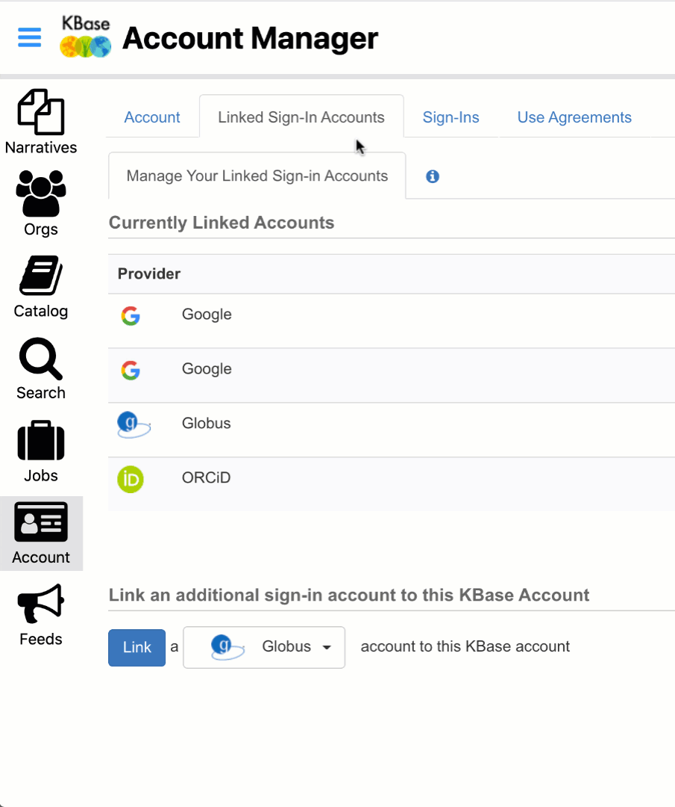
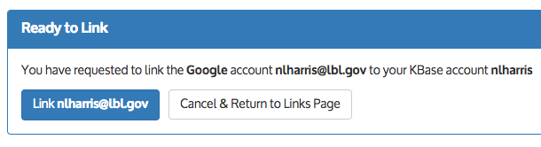
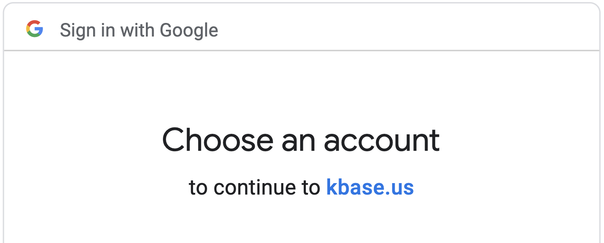

# Linking Accounts

Linking Accounts can be helpful for data transfers, ease of signing in, and sharing data. You can link your KBase Account to Google, Globus, and ORCiD. 

To do this, ****first sign into KBase and go through the normal sign-in process.

On the left sidebar menu, click the “Account” icon, and then choose the tab labeled “Linked Sign-In Accounts”.

At the bottom of the tab, choose an account type from the pulldown list of identity providers, and then click the “Link” button.

The next screen will prompt you to Sign in using your to the chosen account type to link.

After you click that Link button, you will be returned to the Linked Sign-in Accounts screen, where you will see your newly linked account. 

### Example

If you have a Google \(gmail\) account, you can link it to your KBase account.

To do this, you must first sign in to KBase with your current KBase account login. If you are not already signed in to KBase, go to the [sign-in page](https://narrative.kbase.us/), click the Sign In button. Go through the normal sign-in process.

On the left sidebar of your menu, click the “Account” icon, and then choose the tab labeled “Linked Sign-In Accounts”.

At the bottom of the tab, choose “Google” from the pulldown list of identity providers.

Then click the “Link” button. The next screen will prompt you to choose a Google account to link \(some people have more than one\).

You are now ready to link your Google account to your KBase account.

After you click that Link button, you will be returned to the Linked Sign-in Accounts screen, where you will see your newly linked Google account.

### The next time you sign in with your Google credentials

Now when you want to sign in to KBase, you can also use the “Sign in with Google” button.

This will bring you straight to the “Choose an account” Google page:

After you choose your linked Google account, you’ll be signed in to KBase! \(Note that if you had signed out of that Google account, you will be directed to sign into it again before you login to KBase.\)

We hope you appreciate the convenience of being able to sign-in to KBase with your Google credentials. If you encounter any difficulties or have any questions, please feel free to [contact us](https://kbase.us/contact-us/)!

