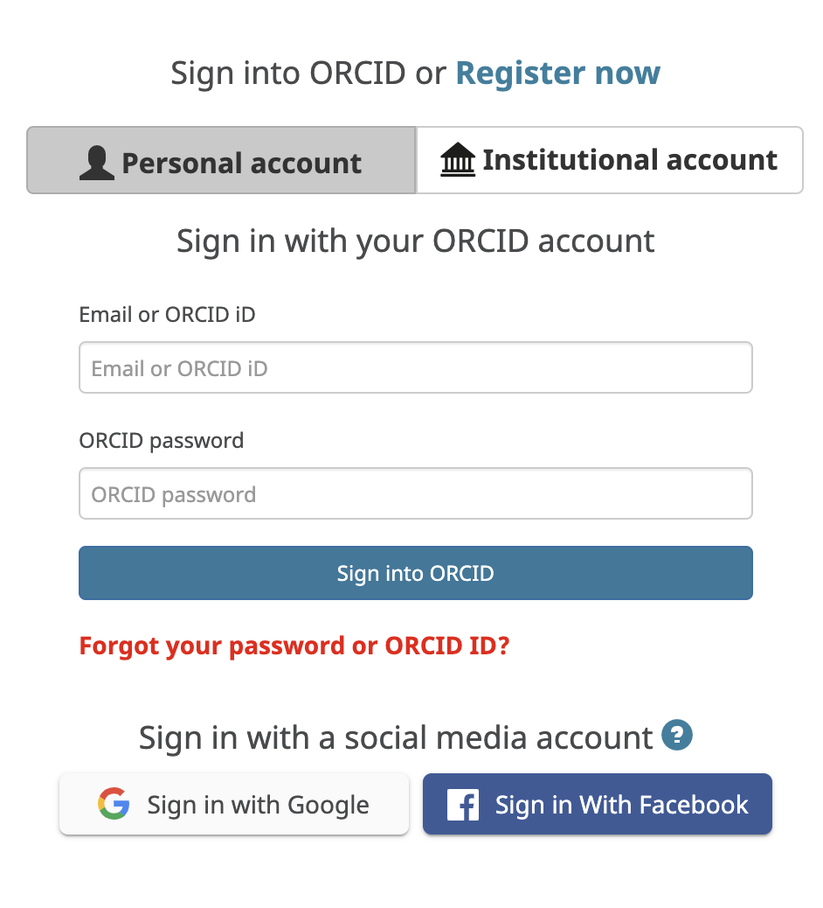
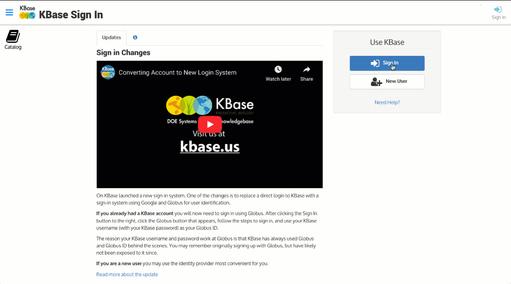

# Linking KBase to ORCiD

If you have an[ ORCiD](https://orcid.org/) account, you can sign into KBase using your [ORCiD ](https://orcid.org/)  and link it to your KBase account.


KBase is an [ORCiD Member Organization. ](https://orcid.org/members/0016f00002ZLyhNAAT-kbase)


If you are already a KBase User, ****first sign into KBase through your Globus or Google accounts. If you are not already signed in to KBase, go to the [sign-in page](https://narrative.kbase.us/), click the Sign In button, and click either “Sign in with Google”  or “Sign in with Globus” buttons and go through the normal sign-in process until you get to Narratives.

On the left sidebar menu, click the “Account” icon, and then choose the tab labeled “Linked Sign-In Accounts”.

At the bottom of the tab, choose " ORCiD” from the pulldown list of identity providers, and then click the “Link” button.

The next screen will prompt you to Sign in using your ORCiD account to link.

After you click that Link button, you will be returned to the Linked Sign-in Accounts screen in your Account Manager, where you will see your newly linked ORCiD account.

You can now sign-in to KBase using your ORCiD ID. 

We hope you appreciate the convenience of being able to sign in to KBase with your ORCiD credentials. If you encounter any difficulties or have any questions, please feel free to [contact us](https://kbase.us/contact-us/)!

