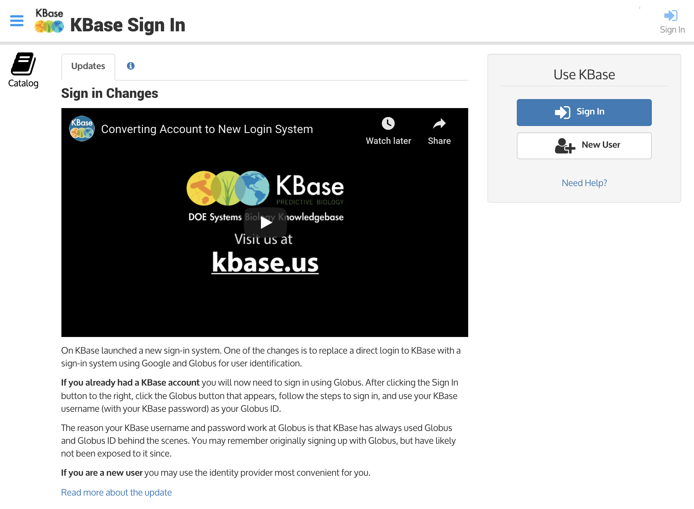

# Authentication Update

On June 9, 2017, KBase switched to a new system for signing up and signing in to KBase that simplified the process for new users. If you already have a KBase account, you will navigate through Globus’s authentication process the first time you sign on to convert your existing account to the new system. After going through the conversion, you’ll be able to sign in to KBase with your existing account or your Google account, if you choose to link your KBase account.


### New users: creating a new KBase account

You can safely ignore the information on this page. For details about setting up a new account, see our [step-by-step signup guide](step-by-step-signup-guide.md)


### Transitioning an existing KBase account

If you already had a KBase account prior to June 9, 2017, then the first time you want to sign into KBase after the authentication change, you will need to go through a few steps to convert your existing KBase \(through Globus\) account. To see what you’ll need to do, you can watch the video and continue reading below.

When you go to [KBase](https://narrative.kbase.us/) to sign in, you will see this:

Click the Sign In button below “Use KBase” and sign-in options will appear

**Sign in using Globus**. Globus is the home of the existing KBase user accounts, and your Globus ID is your KBase ID.

When you click “Sign in with Globus”, a page to Log in with your Globus credentials will open:  

Click Continue. You will reach another page at Globus, requesting your Globus username and password \(remember, this is the same as your existing KBase account\).

Enter your usual KBase username and password. Your username is not your email address – it should not contain an “@” sign. **If you forgot your password, use the “Forgot password?” link at the lower right.**

After entering your username and password, click the “Log In” button. You will be taken to a page where KBase requests access to your email address and Globus identities. Click the blue “Allow” button. We won’t share your email address or personal information outside of KBase.

You must now agree to the KBase User Agreement and KBase Data Policy. \(The User Agreement and Data Policy have not changed since you last agreed to them. This is merely a reconfirmation required by the new authentication process.\)

Read the KBase User Agreement and KBase Data Policy and check the checkboxes that say “I have read and agree to this policy”

Once you’ve checked both of the checkboxes, you will be able to click the blue button at the bottom that says “Continue to the KBase account \[username\]”.

Once you click that Continue button, you’re done – you should see your KBase Dashboard. 

Note – the system changes mean that your profile may look a bit bare-bones. Please fill in the information in your profile when you get a chance, and choose or upload a new avatar if you like.

### The next time you sign in with your Globus account

The first time you sign into KBase after the authentication change, you will need to go through all the steps described above. Subsequently, if you choose to sign-in using your Google credentials, the process will look like this:

1. Go to [narrative.kbase.us](https://narrative.kbase.us/)

2. Click the Sign In button below “Use KBase” and more options will appear:

3. Click “Sign in with Globus”. 

Most of the time, you will not need to sign into Globus \(as it will remember you unless you sign out of KBase\), so you will see a screen like this:

4. Click the blue button at the bottom that says “Sign in to KBase account \[username\]” and you will be at your KBase dashboard!

Note that if you had signed out completely from Globus after the last time you used KBase, you might have to go through two extra steps to sign-in to Globus. Click "Continue" and then proceed to enter Globus Log in information. 

If you encounter any difficulties or have any questions, please feel free to [contact us](https://kbase.us/contact-us/). 

### Linking your Google account to your KBase account

If you have a Google \(gmail\) account, you can link it to your KBase account.

To do this, **you must first sign in to KBase with your Globus account** \(which is the same as your existing KBase account – see above\). If you are not already signed in to KBase, go to the [sign-in page](https://narrative.kbase.us/), click the Sign In button. Click “Sign in with Globus” to sign in with your current account information.

Go through the normal Globus sign-in process until you get to your Dashboard.

On the left sidebar of your dashboard, click the “Account” icon, and then choose the tab labeled “Linked Sign-In Accounts”.

At the bottom of the tab, choose “Google” from the pulldown list of identity providers.

Then click the “Link” button. The next screen will prompt you to choose a Google account to link \(some people have more than one\).

You are now ready to link your Google account to your KBase account.

After you click that Link button, you will be returned to the Linked Sign-in Accounts screen in your Dashboard, where you will see your newly linked Google account.

### The next time you sign in with your Google credentials

Now when you want to sign in to KBase, you can also use the “Sign in with Google” button.

This will bring you straight to the “Choose an account” Google page:

After you choose your linked Google account, you’ll be signed in to KBase! \(Note that if you had signed out of that Google account, you will be directed to sign into it again before you get to your KBase dashboard.\)

We hope you appreciate the convenience of being able to sign-in to KBase with your Google credentials. If you encounter any difficulties or have any questions, please feel free to [contact us](https://kbase.us/contact-us/)!

### Linking your ORCiD account to your KBase account

If you have an ORCiD account, you can also link it to your KBase account.

To do this, **you must first sign in to KBase through your Globus or Google accounts** \(which is the same as your existing KBase account–see above\). If you are not already signed in to KBase, go to the [sign-in page](https://narrative.kbase.us/), click the Sign In button, and click either “Sign in with Google”  or “Sign in with Globus” buttons.   
  
Go through the normal sign-in process until you get to your Dashboard.

On the left sidebar of your dashboard, click the “Account” icon, and then choose the tab labeled “Linked Sign-In Accounts”.

At the bottom of the tab, choose “ORCiD” from the pulldown list of identity providers, and then click the “Link” button.

The next screen will prompt you to Sign into your ORCiD account to link.

After you click that Link button, you will be returned to the Linked Sign-in Accounts screen in your Dashboard, where you will see your newly linked ORCiD account.

You can then Sign In to KBase using your ORCiD account. 

We hope you appreciate the convenience of being able to sign in to KBase with your ORCiD credentials. If you encounter any difficulties or have any questions, please feel free to [contact us](https://kbase.us/contact-us/)!

