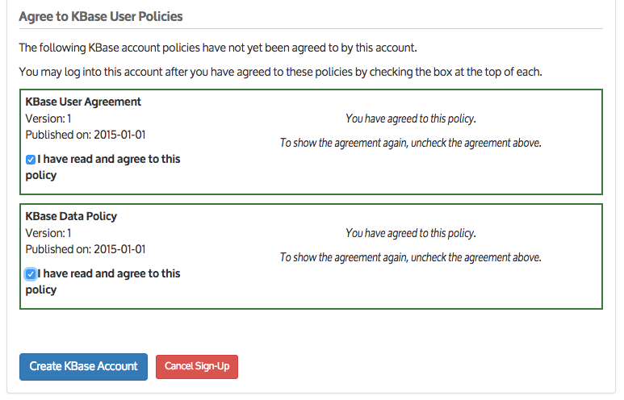

# Step-by-Step Signup Guide

This page provides step-by-step instructions for signing up to use KBase. You will use your existing account at Google or Globus, and it will be linked to your new KBase account.

1. From the [KBase sign-in page](https://narrative.kbase.us/), select the “New User” option.

2. Use your existing Google, ORCiD, or Globus account to sign up for KBase. 


**What if I don't have a Google, ORCiD, or Globus account?**

It’s easy and free to get a new account with one of our identity providers.   
[Get a Google account](https://accounts.google.com/signup)    
[Get an ORCiD account](https://orcid.org/register)    
[Get a Globus ID](https://globusid.org/create)  
  
We are also considering adding support for other identity providers. If there’s one you’d like us to add, please [contact us](https://kbase.us/contact-us/).


3. Assuming you want to use your Google account, click on the “Sign in with Google” button; you will be prompted to choose a Google account \(if you have more than one\) and sign in to it \(if you aren’t already signed in\).  

4. The KBase account creation form will prompt you to enter some required information, which includes choosing a username and identifying your organization and department.  

5. You must now agree to the KBase User Agreement and KBase Data Policy. \(Note - If you already had a KBase account, the User Agreement and Data Policy have not changed since you last agreed to them. This is merely a reconfirmation required by the new authentication process.\)

Read the KBase User Agreement and KBase Data Policy and check the checkboxes that say “I have read and agree to this policy”

Once you’ve checked both boxes for User Agreement and Data Policy, you will be able to click the blue button at the bottom that says “Create KBase Account”.

6. You’re done – you now have a KBase account!  
  
Click “Continue” and you’ll see your KBase Dashboard. You may want to take a look at the [Narrative Quick Start](../narrative-quick-start.md) or [other documentation](../narrative-user-guide/) before you plunge headfirst into KBase.

If you encounter any difficulties or have any questions, please feel free to [contact us](https://kbase.us/contact-us/)!

