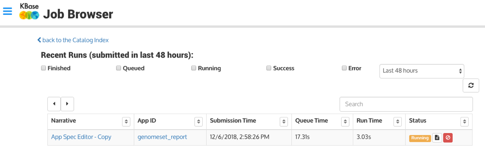

# Job Browser

The Job Browser is one of the buttons on the left sidebar of the Dashboard. In addition to watching jobs within the Narratives, the Job Browser allows you to monitor and manage your jobs. By default, it shows all jobs submitted within the last 48 hours. You can change the timeframe to an hour, a week, a month, or a custom range of dates.

The check boxes allow you to filter the jobs by _Finished_, _Queued_, _Running_, _Success_, and _Error._ You can check as many filters you want. Clicking one of the filters or changing the timeframe will update the page. Otherwise, the table does not auto-refresh. The two arrows in a circle to the right and below the timeframe will refresh the results in the table.

The results display basic information for the jobs such as the Narrative they are located within, App ID, Submission Time, Queue Time, Run Time, and Status. The name of the Narrative is hot-linked, and clicking on it will open a new tab with the Narrative. The App ID is hot-linked and clicking on it will open a new tab with the catalog page for the app.

### Job Status

The Job Status Cell has the status, an icon for the log, and a red cancel icon. Click the log icon to expand the table and show the contents of the log. Click the icon again to collapse the table. Canceling the job will prompt you to make sure you didn’t click it accidentally. Jobs that have been canceled may continue to show up as “Queued” or “Running” until they clear the system.

### Job Log

The Job ID and worker node are easily located and the log can be scrolled through within the pop-out. Job Logs can be downloaded in CSV, TSV, JSON, and TEXT formats using the download \(downward-facing arrow into tray\) icon. 

