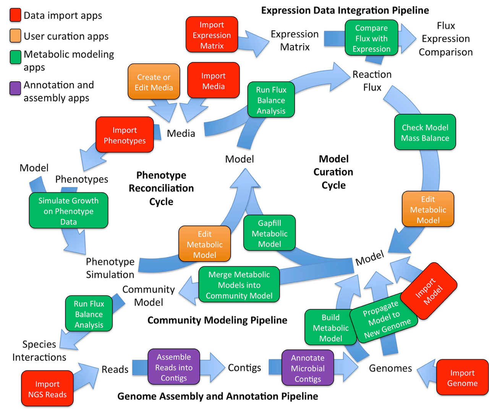

# Metabolic Modeling in KBase

KBase has a suite of [Apps](../../app-catalog.md) and data that support the reconstruction, prediction, and design of metabolic models in microbes and plants. Genome-scale metabolic models are primarily reconstructed from protein functional annotations. These genome-scale metabolic models can be used to explore an organism’s growth in specific media conditions, determine which biochemical pathways are present, optimize production of an important metabolite, identify high flux pathways, and more.

Metabolic models can be used to evaluate an organism’s metabolic capability by simulating growth under different conditions to answer important biological questions such as:

* What biochemical pathways are present?
* What are the high flux pathways under a certain growth condition?
* Could the organism grow anaerobically?
* Would it grow under certain minimal media conditions?
* Could the organism be optimized to produce a particular drug molecule or industrially important biofuel?

### KBase Metabolic Modeling Capabilities

**Generate Genome-scale Metabolic Models**

* Construct genome-scale metabolic models from a genome and media condition with _Build Metabolic Model_
* Fill in missing reactions based on stoichiometry with _Gapfill Metabolic Model_
* Build unique models suited to specific experiments with _Edit Metabolic Model_
* View multiple models side by side with _Compare Models_

**Analyze Flux Balance**

* Predict metabolic fluxes with _Run Flux Balance Analysis_
* Create specialized growth conditions with _Edit Media_
* Determine optimal conditions of flux with _Compare FBA Solutions_
* Ensure accuracy with _Check Model Mass Balance_

**Extrapolate Models**

* Reconcile models with empirical data with _Simulate Growth on Phenotype Data_
* Translate metabolic models from one organism to another with _Propagate Model to New Genome_
* Investigate community metabolism with _Merge Metabolic Models into Community Models_
* Save modeling data for future analysis with _Bulk Download Modeling Objects_

Flowchart of apps used in Metabolic Modeling.


**Learn More**

The flowchart above shows KBase’s metabolic modeling tools \(green\) as well as some other analysis tools. Check the [App Catalog](../../app-catalog.md) for the latest set of metabolic modeling analysis tools \(Apps\).

The [video tutorial](https://www.youtube.com/watch?v=AQ2KsrQrq9s&list=PLh7Q4SqpZYTwdK8ekQnqKinFzbqZuzu8f) below presents an introduction to building metabolic models in KBase. The [“Microbial Metabolic Model Reconstruction and Analysis” Narrative tutorial](../../../running-common-workflows-1/metabolic-modeling-in-kbase.md#narrative-tutorial) lets you see and try out for yourself some examples of KBase’s metabolic modeling functionality in action. Common questions and answers about KBase’s metabolic modeling tools can be found in the [Metabolic Modeling FAQ](metabolic-modeling-faq.md).




### Metabolic Modeling Resources in KBase

**Narrative Tutorial and FAQ**

* [Metabolic Modeling FAQ](../../../running-common-workflows-1/faq-metabolic-modeling-in-kbase.md): questions and answers about metabolic modeling in KBase
* [Narrative tutorial: metabolic model reconstruction and gapfilling](https://narrative.kbase.us/narrative/ws.18302.obj.61)

**Build and Gapfill Metabolic Model**

* Build Metabolic Model: [App details;](https://narrative.kbase.us/#appcatalog/app/fba_tools/build_metabolic_model/release) [Tutorial](https://kbase.us/run-flux-balance-analysis-method/)
* Gapfill Metabolic Model: [App details](https://narrative.kbase.us/#appcatalog/app/fba_tools/gapfill_metabolic_model/release); [Tutorial](https://kbase.us/run-flux-balance-analysis-method/)
* Create or Edit Media: [App details](https://narrative.kbase.us/#catalog/apps/fba_tools/edit_media/release)

**Flux Balance Analysis**

* Run Flux Balance Analysis: [App details](https://narrative.kbase.us/#appcatalog/app/fba_tools/run_flux_balance_analysis/release); [Tutorial](https://kbase.us/run-flux-balance-analysis-method/)
* Compare FBA solutions: [App details](https://narrative.kbase.us/#appcatalog/app/fba_tools/compare_fba_solutions/release)
* View FBA Expression Comparison: [App details](https://narrative.kbase.us/#catalog/apps/fba_tools/view_fba_expression_comparison/release)

**Evaluate, Compare and Edit Models**

* Check Model Mass Balance: [App details](https://narrative.kbase.us/#catalog/apps/fba_tools/check_model_mass_balance/release)
* Compare Flux with Expression: [App details](https://narrative.kbase.us/#catalog/apps/fba_tools/compare_flux_with_expression/release)
* Compare Models: [App details](https://narrative.kbase.us/#appcatalog/app/fba_tools/compare_models/release)
* Edit Metabolic Model: [App details](https://narrative.kbase.us/#catalog/apps/fba_tools/edit_metabolic_model/release)
* Propagate Model to New Genome: [App details](https://narrative.kbase.us/#catalog/apps/fba_tools/propagate_model_to_new_genome/release); [Tutorial](https://kbase.us/propagate-genome-scale-model-to-close-genome-app/)

**Phenotype and Expression**

* Simulate Growth on Phenotype Data: [App details](https://narrative.kbase.us#narrativestore/method/simulate_growth_on_a_phenotype_set); [Tutorial](https://kbase.us/simulate-growth-on-phenotype-data-method/)
* Compare Flux with Expression: [App details](https://narrative.kbase.us/#catalog/apps/fba_tools/compare_flux_with_expression/release)
* View FBA Expression Comparison: [App details](https://narrative.kbase.us/#catalog/apps/fba_tools/view_fba_expression_comparison/release)

**Community Modeling**

* Merge Metabolic Models into Community Model: [App details](https://narrative.kbase.us/#catalog/apps/fba_tools/merge_metabolic_models_into_community_model/release)
* [Constructing and Analyzing Metabolic Flux Models of Microbial Communities](constructing-and-analyzing-metabolic-flux-models-of-microbial-communities.md)
* [Narrative: Modeling a plant-microbe interaction](https://narrative.kbase.us/narrative/ws.9667.obj.2)

**Publications about Metabolic Modeling in KBase**

* [Constructing and Analyzing Metabolic Flux Models of Microbial Communities](constructing-and-analyzing-metabolic-flux-models-of-microbial-communities.md)
* Modeling Central Metabolism and Energy Biosynthesis across Microbial Life: [Publication](http://bmcgenomics.biomedcentral.com/articles/10.1186/s12864-016-2887-8); [Narrative](https://narrative.kbase.us/narrative/ws.15253.obj.1)
* Microbial Community Metabolic Modeling: A Community Data-Driven Network Reconstruction: [Publication](http://onlinelibrary.wiley.com/doi/10.1002/jcp.25428/full); [Narrative](https://narrative.kbase.us/narrative/ws.13807.obj.1)

