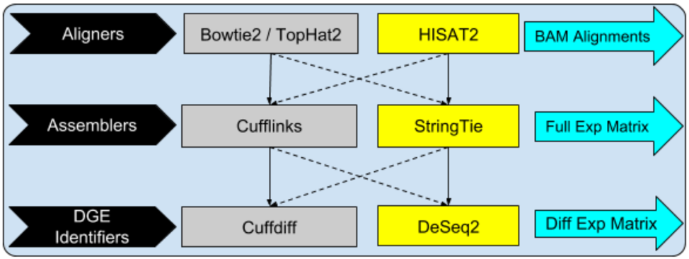
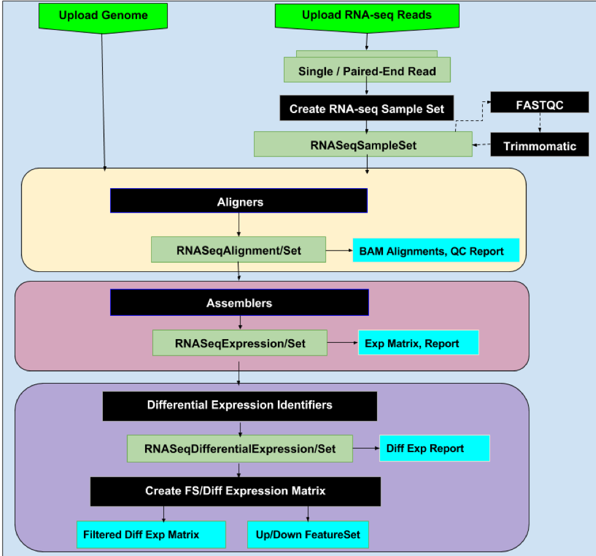

# Transcriptomics and Expression Analysis in KBase

 KBase offers a powerful suite of expression analysis tools. Starting with short reads, you can use the tool suite to assemble and quantify long transcripts, identify differentially expressed genes, cluster them and analyze them as functionally enriched modules. You can also compare the expression data with the flux when studying metabolic models in KBase and identify pathways where expression and flux agree or conflict.

#### Narrative Tutorials

You can copy these tutorials and re-run any of the steps \(perhaps changing parameters or using your own data\) in your KBase account.

1. [Arabidopsis RNA-seq Analysis Tutorial](https://narrative.kbase.us/narrative/ws.19391.obj.1)
2. [E. coli RNA-seq Analysis Tutorial](https://narrative.kbase.us/narrative/ws.50093.obj.1)

#### Why Run RNA-seq and Expression Analysis in KBase

Whether you are a beginner or advanced user of RNA-seq, you will find that KBase’s expression analysis tool suite offers a number of advantages, including some unique to KBase:

1. **Modular \(Plug-n-Play\):** We offer you the flexibility to pick and choose from an array of available Apps for a given step of the pipeline, while the pipeline works seamlessly end-to-end.
2. **Easy and powerful interface:** The Apps are designed to be easily usable by beginners and have abstracted away most of the advanced options, though these are still available to advanced users.
3. **Extensible:** Supported by standard data types, the tool suite is easy to extend by 3rd party developers who want to add new tools.
4. **Easy upload and download:** You can easily [upload](../../working-with-data-1/data-upload-download-guide/) reads, genomes and expression matrices from local and remote public sites. You can also [download](../../working-with-data-1/data-upload-download-guide/) BAM, expression matrices and tool outputs for a number of intermediate steps.
5. **Unrestricted data and compute:** You can store and analyze an unrestricted amount of RNA-seq data in a reasonable time and free of cost.
6. **Well documented:** You can refer to a variety of documentation for [Apps](https://narrative.kbase.us/#catalog/apps), helpful [Narrative tutorials](https://kbase.us/narrative-library/), and broader KBase documentation.
7. _**Active support:**_ You can contact us at [engage@kbase.us](mailto:engage@kbase.us) or through the [KBase Help Board](../../troubleshooting-1/support.md) to ask questions or share feedback.

#### Prerequisites for RNA-seq Analysis

We support the popular Tuxedo suite of tools \(original and new\) for RNA-seq analysis. As a result, KBase requires reference genome to guide the analysis of short reads. 

Here are the prerequisites:

1. **Import Genome:** Use the [Public tab in Data Panel](../../getting-started/narrative-user-guide/add-data-to-your-narrative.md) to choose the reference genome from KBase’s public data. If it’s not available, you can use the [Import tab in Data Panel](../../getting-started/narrative-user-guide/add-data-to-your-narrative.md) to import the genome of interest to your Narrative.
2. **Import Short Reads:** Use the Import tab or any of the reads uploader apps from the [Apps Panel](../../getting-started/narrative-user-guide/browse-kbase-analysis-tools.md) to import the short reads from your experiment into your Narrative. Example reads are also available from the [Public tab](../../getting-started/narrative-user-guide/add-data-to-your-narrative.md). The reads must be a set of single-end, paired-end, or interleaved paired-end reads in FASTA, FASTQ, or SRA format.
3. **Create Sample Set:** Run the [Create RNA-seq Sample Set](https://narrative.kbase.us/#catalog/apps/KBaseRNASeq/describe_rnaseq_experiment/release) App to group together your reads into an RNA-seq sample set with associated experimental metadata so that you can easily and efficiently run the RNA-seq Apps in batch mode wherever appropriate.
4. **QC Sample Set:** Run [FASTQC](https://narrative.kbase.us/#appcatalog/app/kb_fastqc/runFastQC/release) to assess the read quality of the reads set from the previous step and if needed, run [Trimmomatic](https://narrative.kbase.us/#appcatalog/app/kb_trimmomatic/run_trimmomatic/release), [Cutadapt](https://narrative.kbase.us/#appcatalog/app/kb_cutadapt/remove_adapters/release), or [PRINSEQ](https://narrative.kbase.us/#appcatalog/app/kb_PRINSEQ/execReadLibraryPRINSEQ/release) to pre-process or filter the reads before starting RNA-seq analysis.

#### RNA-seq Analysis

The RNA-seq pipeline in KBase is modular and consists of three steps. You can pick any of the multiple Apps available for a given step depending on your preference or individual characteristics of the App.

1. **Read Alignment:** Run the [BowTie2](https://narrative.kbase.us/#appcatalog/app/kb_Bowtie2/align_reads_using_bowtie2/release) app or the splice-aware [TopHat2](https://narrative.kbase.us/#catalog/apps/kb_tophat2/align_reads_using_tophat2/release), [HISAT2](https://narrative.kbase.us/#catalog/apps/kb_hisat2/align_reads_using_hisat2/release), or [STAR](https://narrative.kbase.us/#catalog/apps/STAR/align_reads_using_STAR/beta) apps to map short reads to the reference genome. The output is a set of BAM alignments and Qualimap report. You can download the alignment output object generated by aligner Apps for further analysis.
2. **Transcriptome Assembly and Quantification:** Run the [Cufflinks](https://narrative.kbase.us/#catalog/apps/kb_cufflinks/assemble_transcripts_using_cufflinks/release) or [StringTie](https://narrative.kbase.us/#catalog/apps/kb_stringtie/run_stringtie/release) App on the read alignments from the previous step to generate and assemble full-length transcripts and quantify transcripts and genes as appropriate. You can view downloadable normalized full expression matrices in FPKM \(fragments per kilobase of exon model per million mapped reads\) and TPM \(transcripts per million\).
3. **Differential Gene Expression:** Run the [Cuffdiff](https://narrative.kbase.us/#catalog/apps/kb_cufflinks/run_Cuffdiff/release) or [Ballgown](https://narrative.kbase.us/#catalog/apps/kb_ballgown/run_ballgown_app/release) or [DESeq2](https://narrative.kbase.us/#catalog/apps/kb_deseq/run_DESeq2/release) App to generate gene or transcript level differential expression based on the quantification from the previous step. Run [Create Feature Set/Filtered Expression Matrix From Differential Expression](https://narrative.kbase.us/#appcatalog/app/FeatureSetUtils/upload_featureset_from_diff_expr/release) after selecting appropriate q-value and fold change cutoffs as input parameters for the filtering of the differential gene expression.

#### Downstream Expression Analysis

KBase offers a number of Apps to filter, cluster, visualize, and functionally enrich the feature sets based on differential expression derived from RNA-seq analysis. Also, the expression data from RNA-seq can be assimilated into metabolic models to identify pathways where expression and flux agree or conflict.

1. **Filtering:** You can [create a filtered expression matrix and associated feature set](https://narrative.kbase.us/#catalog/apps/FeatureSetUtils/upload_featureset_from_diff_expr/release) based on fold-change or adjusted p-value. You can also [filter an expression matrix](https://narrative.kbase.us/#catalog/apps/CoExpression/expression_toolkit_filter_expression/release) based on LOR or ANOVA.
2. **Clustering:** Depending on your preference, run the [Hierarchical](https://narrative.kbase.us/#catalog/apps/KBaseFeatureValues/expression_toolkit_cluster_hierarchical/release), [K-Means](https://narrative.kbase.us/#catalog/apps/KBaseFeatureValues/expression_toolkit_cluster_k_means/release) or [WGCNA](https://narrative.kbase.us/#catalog/apps/CoExpression/expression_toolkit_cluster_WGCNA/release) clustering App to group features into clusters based on gene expression. You can also visualize the clusters as an interactive heatmap.
3. **Functional Enrichment:** [Assess the functional enrichment](https://narrative.kbase.us/#appcatalog/app/kb_functional_enrichment_1/functional_enrichment_go_term/release) for a set of features using associated GO terms.
4. **Integration into Metabolic Models:** Assimilate the expression data from RNA-seq into the metabolic models to [compare reaction fluxes with gene expression](https://narrative.kbase.us/#appcatalog/app/fba_tools/compare_flux_with_expression) and thus identify pathways where expression and flux agree or conflict.

_Figure 1: The original and new Tuxedo RNA-seq analysis suites in KBase have modular Apps for building flexible analysis workflows._

_Figure 2: The complete differential RNA-seq workflow in KBase_

#### 

#### Expression Analysis Resources in KBase

 **Narrative Tutorials**

* RNA-seq Analysis using New Tuxedo Suite \(Arabidopsis\): [https://narrative.kbase.us/narrative/ws.19391.obj.1](https://narrative.kbase.us/narrative/ws.19391.obj.1)
* RNA-seq Analysis \(E. coli\): [https://narrative.kbase.us/narrative/ws.50093.obj.1](https://narrative.kbase.us/narrative/ws.50093.obj.1)

**Reads Management**

* FastQC – Read quality analysis [— App details](https://narrative.kbase.us/#appcatalog/app/kb_fastqc/runFastQC/release)
* CutAdapt – Remove adapter sequences from reads with cutadapt [— App details](https://narrative.kbase.us/#appcatalog/app/kb_cutadapt/remove_adapters/release)
* Trimmomatic – Read trimming [— App details](https://narrative.kbase.us/#appcatalog/app/kb_trimmomatic/run_trimmomatic/release)

**Reads Aligners**

* Align Reads using Bowtie2 [— App details](https://narrative.kbase.us/#appcatalog/app/KBaseRNASeq/align_reads_using_bowtie2/release)
* Align Reads using Tophat2 [— App details](https://narrative.kbase.us/#appcatalog/app/KBaseRNASeq/align_reads_using_tophat/release)
* Align Reads using HISAT2 [— App details](https://narrative.kbase.us/#appcatalog/app/KBaseRNASeq/align_reads_using_hisat2/release)

**Reads Assemblers**

* Assemble transcripts using Cufflinks [— App details](https://narrative.kbase.us/#appcatalog/app/KBaseRNASeq/assemble_transcripts_with_cufflinks/release)
* Assemble transcripts using StringTie [— App details](https://narrative.kbase.us/#catalog/apps/KBaseRNASeq/assemble_transcripts_with_stringtie/release)

**Differential gene identifiers**

* Create Differential Expression Matrix using Cuffdiff [— App details](https://narrative.kbase.us/#catalog/apps/KBaseRNASeq/identify_differential_expression_using_cuffdiff/release)
* Create Differential Expression Matrix using Ballgown [— App details](https://narrative.kbase.us/#catalog/apps/KBaseRNASeq/identify_differential_expression_using_ballgown/release)
* Create Differential Expression Matrix using DESeq2 [— App details](https://narrative.kbase.us/#catalog/apps/kb_deseq/run_DESeq2/release)

**Filter expression matrix**

* Filter Expression Matrix [— App details](https://narrative.kbase.us/#catalog/apps/CoExpression/expression_toolkit_filter_expression/release)

**Clustering algorithms**

* Cluster Expression Data – Hierarchical [— App details](https://narrative.kbase.us/#catalog/apps/KBaseFeatureValues/expression_toolkit_cluster_hierarchical/release)
* Estimate K for K-means Clustering [— App details](https://narrative.kbase.us/#catalog/apps/KBaseFeatureValues/expression_toolkit_estimate_k/release)
* Cluster Expression Data – K-means [— App details](https://narrative.kbase.us/#catalog/apps/KBaseFeatureValues/expression_toolkit_cluster_k_means/release)
* Cluster Expression Data – WGCNA [— App details](https://narrative.kbase.us/#catalog/apps/CoExpression/expression_toolkit_cluster_WGCNA/release)

**Visualization**

* View Interactive Heatmap [— App details](https://narrative.kbase.us/#catalog/apps/kb_cummerbund/view_expression_interactive_heatmap/release)
* View Multi-cluster Heatmap [— App details](https://narrative.kbase.us/#catalog/apps/CoExpression/expression_toolkit_view_heatmap/release)

