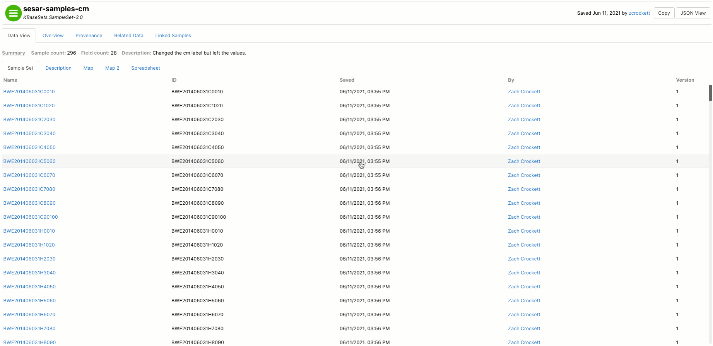

# Managing Samples

## Permissions for Samples

The permissions for Samples are managed separately from the Narrative workspace with some exceptions. Similar to Narrative, a user can have read, write, and share privileges for a Sample.  The permissions for a Sample can be viewed in the Sample landing page under the Access tab and they can be modified using the Update SampleSet Access Controls app in the narrative.  

In addition, when a SampleSet is shared with a user, that user automatically has read access to  all Samples included in the SampleSet.  Read access will automatically be given when they first access the SampleSet by going to its landing page or viewing it in the Narrative.  If you need to grant a user increased permissions \(e.g. to modify Samples\), you should use the Update SampleSet Access Controls app. Be warned that this permissions will be granted for all Samples in the SampleSet. We do not currently provide a mechanism to change the permissions on a single app and we do not currently provide a method to easily revoke permissions.

