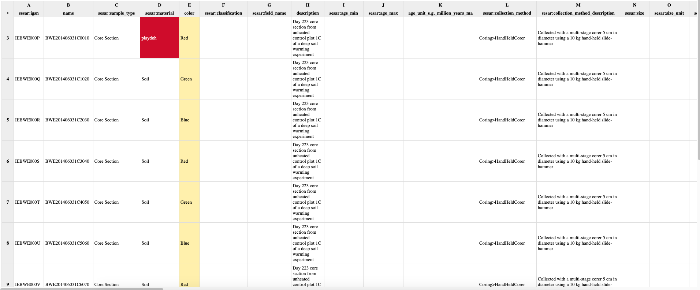

# Error Handling and Reporting

## Error Report Display

The import apps are designed to encourage the use of validated data, but we are aware that not all information is accounted for in our validator, and sometimes wrangling the data to fit validation formats is not worth the effort. While we do encourage validation as much as possible, our importers use a two-tiered system of error reporting.

In the example below, we show both types of errors. When the validation fails to recognize a value for a validated field, such as the type "playdoh" for material, you will see a red error. This prevents the importer from creating a SampleSet for any cell with values that don't comply with controlled vocabulary. The yellow errors indicate a column \(in this case, "color"\) that could not be validated as a controlled field. These result in warnings, but the SampleSet can still be created.

## Tips for Handling Errors

In contrast with most KBase imports, Sample imports can return a "successful" job that does not create an object in the data panel. In this case, you can interpret successful to indicate that the sample file was read, but the contents may or may not be valid.  

As mentioned above, a cell in a validated column that does not comply with the controlled vocabulary will fail to upload. We recommend you consult the documentation either here or at the source of the template to determine if your value is accepted and if the vocabulary contains a valid term for your value. If you would like your term added to the controlled vocabulary, please contact us and we will determine if it can be. If your value is not part of the controlled vocabulary and there is no good alternative, you can change the column header to change it to a user defined field.

If you have a warning due to an unvalidated field, you can choose to accept the warning or decline it and fix the spreadsheet. If you accept an unvalidated field, it will be stored as a user-defined field. This allows you to still capture the information, but does not allow that information to be compared across Samples. If it is simply additional descriptive information, accepting the warning may be beneficial, but if it is information critical to the Samples which you plan to use in analysis, we recommend manually fixing the values to comply with controlled vocabulary terms. 

Currently, no mechanism exists to accept warnings after the import app has run. You can run the app with the "Ignore Warnings" option unchecked, which allows you to see the errors and warnings and does not create an object, then edit your spreadsheet and re-run the app with the warnings fixed, or you can run the app with the option checked and delete the resulting object if you find warnings that you want to fix.

