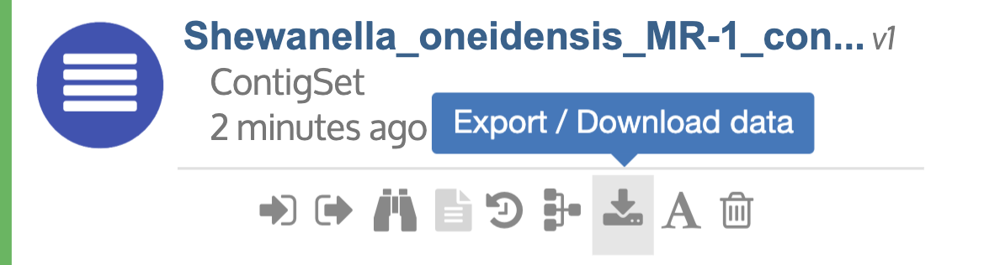

# Downloading Data

## **Download data from your Narrative**

* * Locate the data you wish to download in the **Data Panel** under the _Analyze_ tab
  * Hover your mouse over the data object until a “…” icon appears to the right of its name
  * Click the “…” icon to reveal advanced options
  * Click the seventh icon from the left "Export / Download Data"
  * Select a format for exporting and downloading the data
  * The data will download to the default downloads folder on your computer

When downloading data from KBase, the data will be compressed into a Zip file \(.zip\) containing files \(or a directory containing files\) in the format you selected and a metadata file \(in JSON format\). If you choose to re-upload data you have downloaded from the system, take note that you cannot directly import the Zip file – you must first extract the file and then re-upload using the specified uploader for the data type.

## **Downloading Large Data Objects**

Large data objects \(over 10 gigabases\) include many Reads, Assemblies, Genomes, and Alignment \(BAM\) objects. They encounter many of the same obstacles as uploading large data sets. Just like uploading, this is a 2-stage process; copy the file to the Staging Area and download from Staging to your local computer with [Globus](http://kbase.us/transfer-data-from-globus-to-kbase/).

_Copy the file to the Staging Area \(version 1\)_

* Locate the data you wish to download in the **Data Panel** under the _Analyze_ tab
* Hover your mouse over the data object until a “…” icon appears to the right of its name
* Click the “…” icon to reveal advanced options
* Click the seventh icon from the left "Export/Download Data"
* Select Staging

This will open the app for “Export Data Object to Staging Area”

The name of the Input Object is filled in. A default Destination Directory is filled in, but can be edited and changed. A directory will be created in the Staging Area, and all created files will be copied to the directory. The "show advanced" __Parameters may have more options relevant to your data object.

Once in the Staging Area, large files \(&gt;10GB\) should be transferred to your local machine using [Globus](../transferring-data-with-globus.md). Instead of “To” the “KBase Bulk Share” endpoint, this will be a transfer “From” the “KBase Bulk Share” endpoint.

_Copy the file to the Staging Area \(version 2\)_

* In the **App Panel**, search for the app “Export Data Object to Staging Area,” put in the name of your Input Object for the data object to download, and follow the instructions above.

## **Download links in App Cells**

A few apps have file links as part of the output at the bottom of the App Cell.

Right click on the file name to download and choose “Save Link As" to download and save to your local computer. 

## **Bulk Download**

By popular request, KBase will be rolling out new apps soon that enable Bulk Download of multiple data objects.

